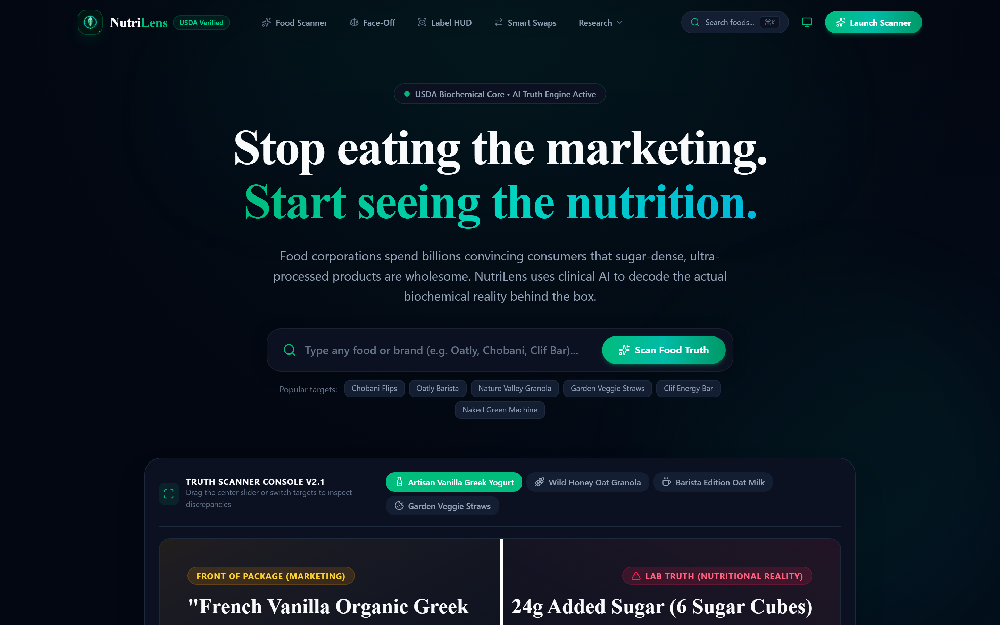
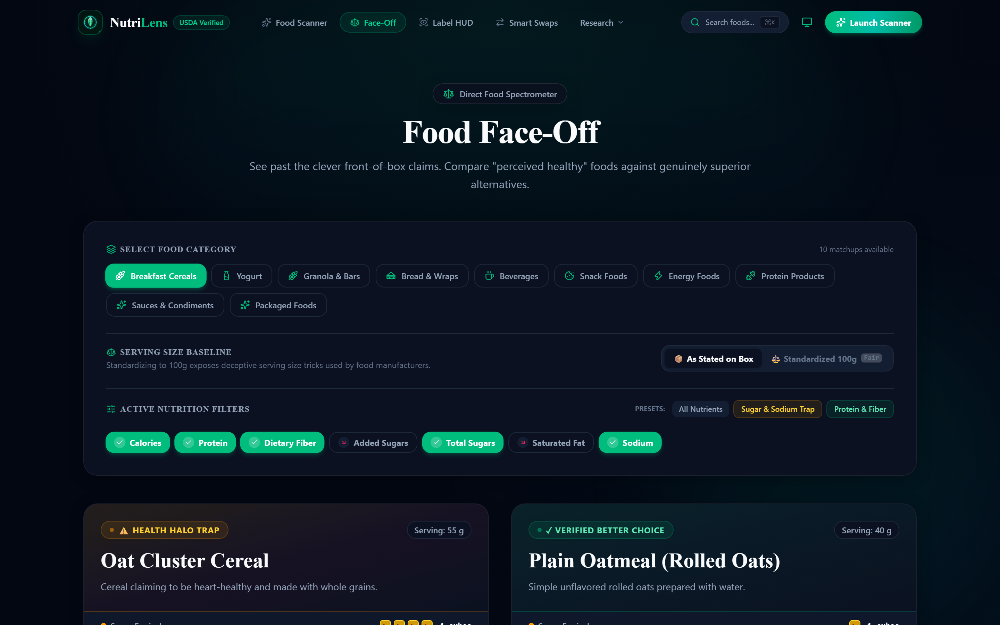
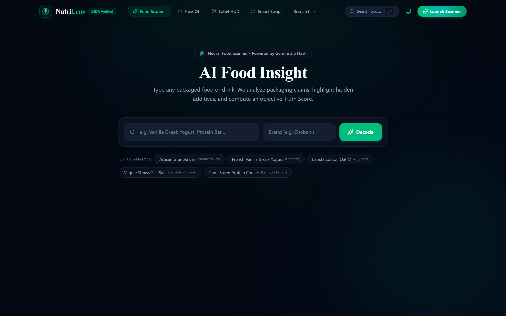
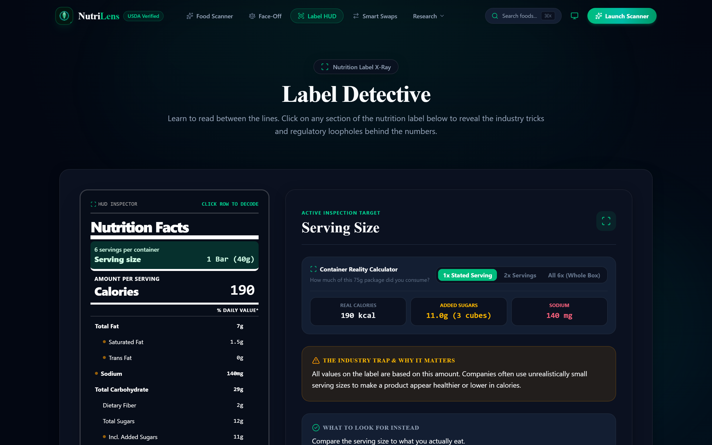
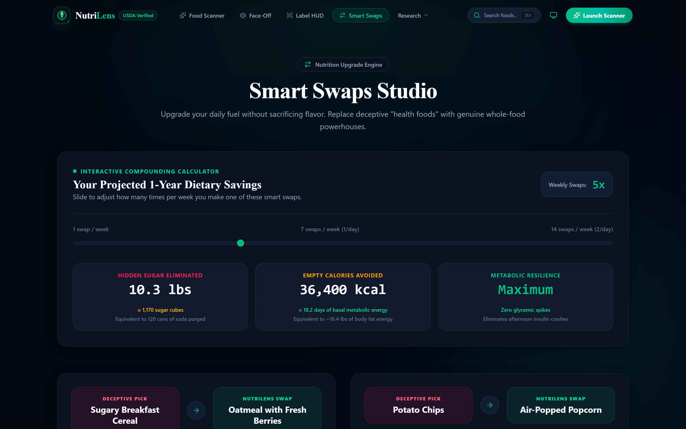
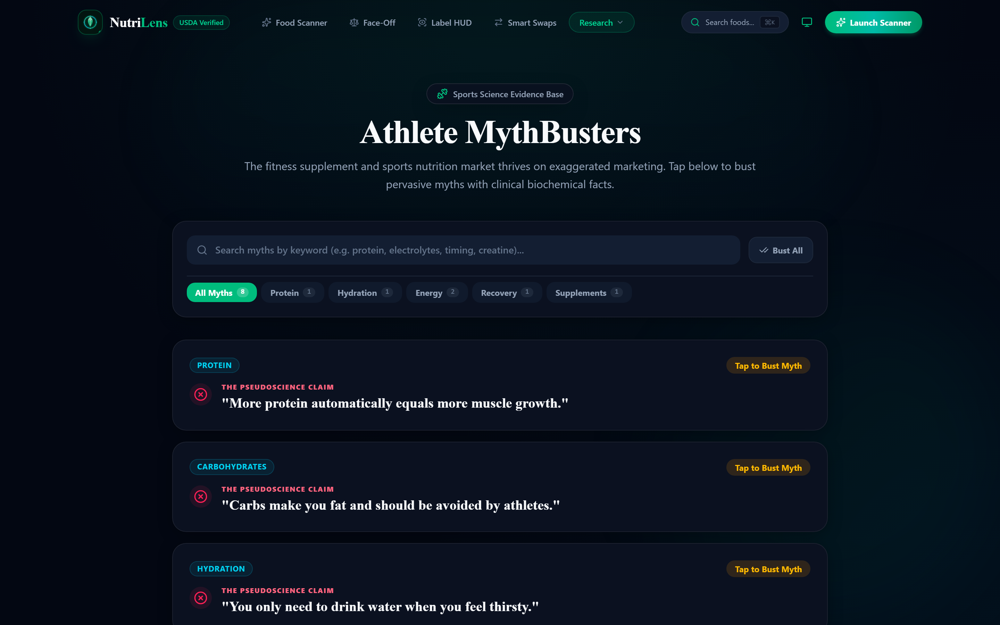
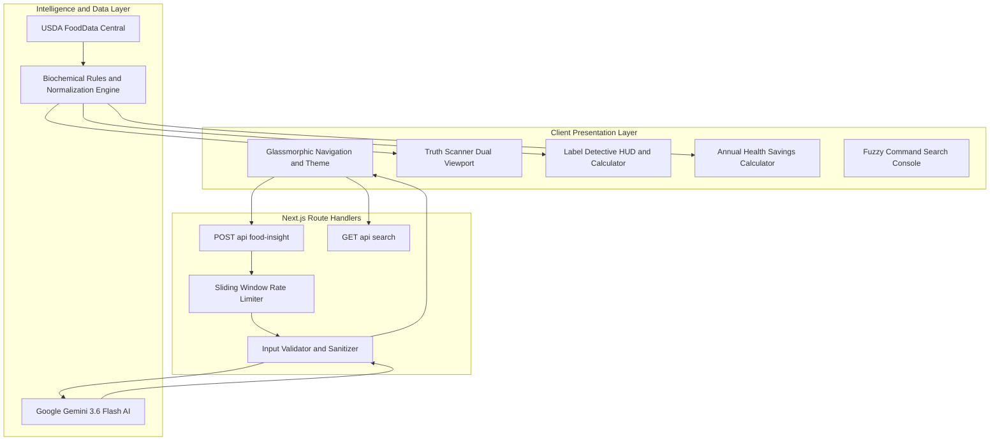

<a name="top"></a>
<div align="center">


# 🌿 NutriLens

<p align="center">
  
</p>

**The open-source clinical nutrition intelligence engine. Unmasking deceptive marketing claims, translating abstract grams into physical sugar cubes, and standardizing food data to verified biochemical reality.**

<br />

<!-- ACTION BUTTONS -->
<p align="center">
  <a href="https://github.com/aadityashekhar321/nutrilens"></a>
  <a href="https://vercel.com/new/clone?repository-url=https://github.com/aadityashekhar321/nutrilens"></a>
  <a href="#-getting-started--local-setup"></a>
  <a href="https://github.com/aadityashekhar321/nutrilens/issues"></a>
</p>

<!-- SHIELDS BADGE RIBBON -->
<p align="center">
  <a href="https://nextjs.org/"></a>
  <a href="https://react.dev/"></a>
  <a href="https://www.typescriptlang.org/"></a>
  <a href="https://tailwindcss.com/"></a>
  <a href="https://ai.google.dev/"></a>
  <a href="https://fdc.nal.usda.gov/"></a>
  <a href="https://vercel.com/analytics"></a>
  <a href="https://vercel.com/docs/speed-insights"></a>
  <a href="https://opensource.org/licenses/MIT"></a>
</p>

<br />

<!-- AUTHENTIC HERO SCREENSHOT -->
<a href="#-core-diagnostic-engines">
  
</a>

<br />

</div>

---

<details open>
<summary><kbd>📖 Table of Contents (Click to collapse / expand)</kbd></summary>

- [⚡ The $14B Health Halo Problem](#-the-14b-health-halo-problem)
- [⚔️ Why NutriLens? (Competitive Matrix)](#️-why-nutrilens-competitive-matrix)
- [🔄 How It Works (4-Stage Pipeline)](#-how-it-works-4-stage-pipeline)
- [🌟 Core Diagnostic Engines (With Verified Screenshots)](#-core-diagnostic-engines)
  - [1. Truth Scanner 2.0](#1--truth-scanner-20-)
  - [2. Food Face-Off Spectrometer](#2-️-food-face-off-spectrometer-compare)
  - [3. AI Food Scanner](#3--ai-food-scanner-food-insight)
  - [4. Interactive Label Detective HUD](#4-️-interactive-label-detective-hud-label-detective)
  - [5. Smart Swaps Studio](#5--smart-swaps-studio-alternatives)
  - [6. Athlete MythBusters](#6--athlete-mythbusters-athletes)
- [🧬 Real Neural Inspection Output (Gemini 3.6 Flash)](#-real-neural-inspection-output)
- [🔬 Clinical Methodology & Regulatory Science](#-clinical-methodology--regulatory-science)
- [🏛️ System Architecture](#️-system-architecture)
- [🛠️ Technology Stack](#️-technology-stack)
- [📂 Project Directory Structure](#-project-directory-structure)
- [🚀 Getting Started & Local Setup](#-getting-started--local-setup)
- [🗺️ Roadmap & Milestones](#️-roadmap--milestones)
- [⭐ Stargazers Over Time](#-stargazers-over-time)
- [🤝 Contributing](#-contributing)
- [📄 License & Clinical Disclaimer](#-license--clinical-disclaimer)

</details>

---

## ⚡ The $14B Health Halo Problem

Food conglomerates spend upwards of **$14 Billion each year** crafting deceptive front-of-pack claims. By exploiting buzzwords like *"All-Natural"*, *"Multi-Grain"*, *"Immunity-Boosting"*, and *"Made with Real Fruit"*, industrial food processors create a psychological **"Health Halo"**—tricking well-intentioned consumers into purchasing ultra-processed desserts marketed as daily wellness staples.

```text
┌──────────────────────────────────────────────────────────────────────────────────┐
│  FRONT-OF-BOX MARKETING CLAIM                                                    │
│  "Artisan Honey Oat Protein Bar" 🌿 (Greenwashed Packaging)                      │
├──────────────────────────────────────────────────────────────────────────────────┤
│  BIOCHEMICAL REALITY UNMASKED BY NUTRILENS                                       │
│  • Added Sugars: 28g  ──►  7 PHYSICAL SUGAR CUBES (🟫 🟫 🟫 🟫 🟫 🟫 🟫)           │
│  • Caloric Load: 350 kcal / 75g package (Not the advertised 35g serving!)        │
│  • Blood Glucose Impact: Equivalent to an entire slice of glazed chocolate cake  │
│  • Regulatory Loophole: Ingredient splitting masks sugar as the #1 ingredient    │
└──────────────────────────────────────────────────────────────────────────────────┘
```

**NutriLens** breaks this illusion. Grounded in **USDA FoodData Central** biochemical baselines and powered by the **Google Gemini 3.6 Flash AI Engine**, NutriLens calculates exact nutrient balances, normalizes misleading serving sizes to standardized 100g baselines, and flags regulatory loopholes in real time.

---

## ⚔️ Why NutriLens? (Competitive Matrix)

Most commercial nutrition apps are designed as tedious calorie-counting diaries behind paywalls. NutriLens was built from the ground up as an **objective intelligence and public health literacy platform**.

| Capability / Feature | 🌿 NutriLens | MyFitnessPal | Yuka | Fooducate |
| :--- | :---: | :---: | :---: | :---: |
| **Health Halo & Greenwashing Decoding** | ✅ **Native Engine** | ❌ None | ⚠️ Basic 0-100 Score | ⚠️ Letter Grades Only |
| **100g Baseline Normalization** | ✅ **1-Click Toggle** | ❌ No | ❌ No | ❌ No |
| **Generative AI Ingredient Audit** | ✅ **Gemini 3.6 Flash** | ❌ No | ❌ No | ❌ No |
| **Portion Reality Multiplier (1x–2.5x)** | ✅ **Interactive HUD** | ⚠️ Manual Typing | ❌ No | ❌ No |
| **Tangible Sugar Cube Stacking Visuals** | ✅ **4g Cube Metaphor** | ❌ No | ❌ No | ❌ No |
| **FDA 21 CFR Loophole Auditing** | ✅ **Automated Flags** | ❌ No | ⚠️ Additives Only | ❌ No |
| **Compounding Annual Impact Calculator**| ✅ **Live Formula** | ❌ No | ❌ No | ❌ No |
| **Core Web Vitals & Real-Time RUM** | ✅ **Vercel Analytics**| ❌ Ad Tracking | ❌ Analytics Only | ❌ Ad Tracking |
| **Zero Paywalls & 100% Open Source** | ✅ **MIT License** | ❌ $79.99/yr Paywall | ❌ Premium Subscription | ❌ Premium Subscription |

---

## 🔄 How It Works (4-Stage Pipeline)

| 1. 📥 Ingestion & Parsing | 2. 🧠 Neural Audit | 3. ⚖️ Biochemical Baseline | 4. 💡 Empower & Swap |
| :--- | :--- | :--- | :--- |
| • Instant text query or category<br>• Query sanitization & rate-limiting<br>• Client-side fuzzy indexing | • **Google Gemini 3.6 Flash**<br>• Deconstructs 60+ sugar aliases<br>• Evaluates glycemic spike risks<br>• Flags AHA ceiling violations | • **USDA FoodData Central**<br>• Standardized 100g normalization<br>• Container reality math<br>• FDA 21 CFR loophole audit | • Tangible 4g sugar cube models<br>• Annual pounds of sugar spared<br>• 1-to-1 whole food alternatives<br>• Evidence-based sports facts |

---

## 🌟 Core Diagnostic Engines

### 1. 🔍 Truth Scanner 2.0 (`/`)

*Interactive dual-viewport slider exposing deceptive marketing claims against laboratory reality.*

<div align="center">
  
</div>

- **Dual-Lens Viewport**: Scrub smoothly between `🏷️ Marketing Claim`, `⚖️ 50/50 Split`, and `🔬 Lab Reality` presets.
- **Physical Sugar Cube Stacks**: Translates abstract grams into visual 4-gram sugar cubes (e.g. 24g sugar = 🟫🟫🟫🟫🟫🟫 6 physical cubes).
- **Biochemical Telemetry Ticker**: Real-time ticker streaming clinical statistics, glycemic impact notes, and regulatory warning flags.

---

### 2. ⚖️ Food Face-Off Spectrometer (`/compare`)

*Direct head-to-head comparison engine with honest 100g baseline normalization.*

<div align="center">
  
</div>

- **100g Baseline Normalization**: Seamlessly toggle between **"📦 As Stated on Box"** and **"⚖️ Standardized 100g Baseline"** to neutralize manufacturer serving size manipulation.
- **8 Core Categories**: Compare perceived healthy foods against whole-food alternatives across Dairy, Granola, Cereals, Beverages, Bread, Snacks, Protein, and Energy Foods.
- **Recharts Spectrometer**: Interactive grouped bar charts with custom delta tooltips, relative scales, and dynamic superiority badges (e.g. *"+150% Superior Fiber"*).

---

### 3. 🤖 AI Food Scanner (`/food-insight`)

*Neural food deconstruction and health halo risk assessment powered by Google Gemini 3.6 Flash.*

<div align="center">
  
</div>

- **Universal Food Lookup**: Analyze any commercial packaged food or beverage in real time (*"Oatly Barista"*, *"Chobani Vanilla"*, *"Kind Dark Chocolate"*).
- **Portion Reality Multiplier**: Toggle between `1.0x Stated Serving`, `1.5x Typical Bowl`, `2.0x Double Portion`, and `2.5x Entire Container` to recalculate nutrient grams and sugar cubes dynamically.
- **AHA Ceiling Alert**: Triggers immediate visual warnings when your portion exceeds the American Heart Association's 25g daily added sugar maximum.
- **Radial Truth Score Gauge (0–100)**: Animated circular SVG dial color-coded by deception risk (*Clean, Moderate Discrepancy, High Deception*).

---

### 4. 🕵️ Interactive Label Detective HUD (`/label-detective`)

*Interactive FDA Nutrition Facts panel with container reality math and deception challenges.*

<div align="center">
  
</div>

- **Nutrition Facts X-Ray**: Interactive FDA-standard Nutrition Facts panel with clickable inspection zones across Serving Size, Sugars, Fats, and Sodium.
- **Container Reality Math**: Click any line item to reveal the full-package impact (e.g., `140 kcal × 2.5 servings = 350 kcal` and `12g sugar × 2.5 = 30g container sugar / 7.5 physical cubes`).
- **Interactive Deception Challenge**: Inspect case files, spot 3 hidden manufacturer loopholes, and test your food label literacy.
- **5-Second Grocery Aisle Checklist**: Practical rule mastery checklist with live progress tracking and certification unlock.

---

### 5. 🔄 Smart Swaps Studio (`/alternatives`)

*1-to-1 food substitutions with a compounding annual sugar savings calculator.*

<div align="center">
  
</div>

- **Compounding Annual Calculator**:
  - Adjust weekly swap frequency dynamically from 1 to 14 times per week.
  - Computes **pounds of pure sugar eliminated annually** (e.g., `14.6 lbs/year`).
  - Converts savings into tangible analogies: **equivalent 12oz cans of soda purged** and **days of human resting metabolic energy spared**.
  - Highlights exact macro delta pills (`-18g Sugar`, `+6g Protein`, `+4g Fiber`) on every swap card.

---

### 6. 🥊 Athlete MythBusters (`/athletes`)

*Evidence-based sports nutrition debunking industry pseudo-science.*

<div align="center">
  
</div>

- **Sports Nutrition Evidence Base**: Debunks persistent myths across Protein Synthesis, Glycogen Replenishment, Hydration & Electrolytes, and Recovery Windows.
- **Live Search & Bulk Actions**: Filter myths by keyword (`protein`, `cramps`, `electrolytes`) or trigger `Bust All` to review all scientific realities at once.
- **Clinical Training Protocols**: Actionable, peer-reviewed advice for endurance athletes, strength training, and metabolic recovery.

---

## 🧬 Real Neural Inspection Output

<details>
<summary><b>🔍 Click to Inspect Sample Gemini 3.6 Flash Neural Analysis Payload</b></summary>

```json
{
  "foodName": "Artisan Honey Oat Protein Granola Bar",
  "brand": "Nature's Promise",
  "truthScore": 38,
  "deceptionRisk": "high",
  "marketingClaims": [
    "All-Natural Whole Grain Goodness",
    "Excellent Source of Protein (10g)",
    "Immunity-Supporting Zinc & Vitamin C"
  ],
  "biochemicalReality": {
    "statedServingGrams": 40,
    "actualPackageGrams": 80,
    "containerServings": 2.0,
    "addedSugarGrams": 24,
    "sugarCubesEquivalent": 6,
    "ahaDailyLimitPercent": 96.0,
    "primarySweetener": "Brown Rice Syrup (High Glycemic Index: 98)",
    "regulatoryLoopholesIdentified": [
      "Ingredient Splitting: Brown rice syrup, cane sugar, and honey listed separately to keep rolled oats as #1 ingredient.",
      "Serving Size Manipulation: 40g serving size on an 80g bar that is universally consumed in one sitting."
    ]
  },
  "smartSwapAlternative": {
    "name": "Toasted Rolled Oats with Crushed Walnuts & Ceylon Cinnamon",
    "netSugarReduction": "20g (5 fewer sugar cubes)",
    "netFiberIncrease": "+4g"
  }
}
```

</details>

---

## 🔬 Clinical Methodology & Regulatory Science

NutriLens grounds every insight in peer-reviewed clinical guidelines and official regulatory documentation:

```text
               ┌─────────────────────────────────────────────────────────┐
               │         GLOBAL NUTRITIONAL SCIENCE STANDARDS            │
               └────────────────────────────┬────────────────────────────┘
                                            │
         ┌──────────────────────────────────┼──────────────────────────────────┐
         ▼                                  ▼                                  ▼
┌──────────────────┐               ┌──────────────────┐               ┌──────────────────┐
│  AHA SUGAR CAPS  │               │ FDA 21 CFR 101.9 │               │   WHO SODIUM     │
│ Men:    36g/day  │               │ Trans Fat < 0.5g │               │ Ceiling:         │
│ Women:  25g/day  │               │ Loophole Exposed │               │ < 2,000 mg/day   │
│ Kids:   24g/day  │               │ Ingredient Split │               │ (5g pure salt)   │
└──────────────────┘               └──────────────────┘               └──────────────────┘
```

1. **American Heart Association (AHA) Added Sugar Standards**:
   - **Men**: Maximum 36g / 9 teaspoons (9 sugar cubes) daily.
   - **Women**: Maximum 25g / 6 teaspoons (6 sugar cubes) daily.
   - **Children**: Maximum 24g / 6 teaspoons daily.
2. **FDA 21 CFR 101 Regulatory Loopholes Exposed**:
   - **The 0.5g Trans Fat Loophole**: Products containing under 0.5g of trans fat per serving are legally permitted to claim *"0g Trans Fat"*. NutriLens flags hidden partially hydrogenated oils in the ingredient list.
   - **Ingredient Splitting**: Brands divide sugars across 4+ synonyms (dextrose, cane syrup, maltodextrin) so that whole oats or fruit appear first on the ingredient list.
3. **World Health Organization (WHO) Sodium Limits**:
   - Recommended daily sodium intake ceiling is `< 2,000 mg/day` (equivalent to approximately 5g of salt).

---

## 🏛️ System Architecture

NutriLens is engineered on the **Next.js 14 App Router**, featuring server-side Google Gemini AI orchestration, client-side reactive visualizers, and USDA open datasets.



---

## 🛠️ Technology Stack

| Layer | Technology | Version | Purpose |
| :--- | :--- | :--- | :--- |
| **Framework** | **Next.js** | `14.2.35` | App Router, Server Components, Route Handlers, Turbopack |
| **UI Library** | **React** | `18.3` | Reactive state management, client hydration, custom hooks |
| **Language** | **TypeScript** | `5.x` | Strict static typing, schema verification, zero `any` policy |
| **Styling** | **Tailwind CSS** | `v4.0` | Modern tokens, CSS custom properties, glassmorphism |
| **AI Engine** | **Google Gemini** | `3.6 Flash` | Structured nutritional inference and health halo risk assessment |
| **Data Viz** | **Recharts** | `3.10` | Responsive SVG grouped bar charts and custom delta spectrometer |
| **Telemetry** | **Vercel Analytics**| `1.5.0` | Privacy-focused real-time visitor telemetry and page views |
| **Performance**| **Speed Insights** | `2.0.0` | Real User Monitoring (RUM) for Core Web Vitals (LCP, FID, CLS, INP) |
| **Icons** | **Lucide React** | Latest | Feather-weight SVG iconography |
| **Theming** | **next-themes** | Latest | System-aware dark, light, and obsidian mode toggle |
| **Data Baseline**| **USDA FoodData** | Official | USDA Agricultural Research Service nutritional profiles |

---

## 📂 Project Directory Structure

```text
nutrilens/
├── public/
│   ├── favicon.svg                    # Vector SVG favicon
│   ├── icon.svg                       # Next.js app icon
│   └── images/
│       ├── real_truth_scanner.png     # Live Truth Scanner 2.0 interface
│       ├── real_food_faceoff.png      # Live Food Face-Off interface
│       ├── real_food_scanner.png      # Live AI Food Scanner interface
│       ├── real_label_detective.png   # Live Label Detective HUD interface
│       ├── real_smart_swaps.png       # Live Smart Swaps Studio interface
│       └── real_athlete_myths.png     # Live Athlete MythBusters interface
├── src/
│   ├── app/
│   │   ├── alternatives/page.tsx      # Smart Swaps & Compounding Calculator
│   │   ├── athletes/page.tsx          # Athlete MythBusters & Live Search
│   │   ├── compare/page.tsx           # Food Face-Off & 100g Normalizer
│   │   ├── explore/page.tsx           # Sneaky Culprits & Alias Filter
│   │   ├── food-insight/page.tsx      # AI Food Scanner & Telemetry HUD
│   │   ├── label-detective/page.tsx   # Label Detective HUD & Checklist
│   │   ├── api/
│   │   │   ├── food-insight/route.ts  # Gemini AI rate-limited route handler
│   │   │   └── search/route.ts        # Instant fuzzy search endpoint
│   │   ├── globals.css                # Obsidian theme, scanlines, animations
│   │   ├── icon.svg                   # Next.js automatic SVG favicon
│   │   ├── layout.tsx                 # Root layout with Vercel Analytics & Speed Insights
│   │   └── page.tsx                   # Truth Scanner 2.0 Hero & Bento Grid
│   ├── components/
│   │   ├── alternatives/              # AlternativeCard & macro upgrade badges
│   │   ├── comparison/                # NutritionChart, ComparisonCard, Toggles
│   │   ├── education/                 # CulpritCard, LabelTermCard, MythCard
│   │   ├── insight/                   # FoodInsightForm, InsightResult, Gauge
│   │   ├── label/                     # LabelSimulator, DeceptionChallenge, Checklist
│   │   ├── layout/                    # Full-width glass Navbar, Footer, ThemeToggle
│   │   ├── search/                    # SearchDialog (keyboard navigation)
│   │   └── ui/                        # Logo, Badge, PageHeader, Error/Loading states
│   ├── data/                          # 9 USDA-grounded nutritional datasets
│   ├── hooks/                         # use-comparison, use-food-insight, use-search
│   ├── lib/                           # ai-client, comparison-engine, rules
│   └── types/                         # TypeScript interfaces and response schemas
├── .env.example                       # Environment template for developers
├── package.json
├── tsconfig.json
└── README.md
```

---

## 🚀 Getting Started & Local Setup

### Prerequisites
- **Node.js**: `v18.17.0` or higher
- **Package Manager**: `npm`, `pnpm`, or `yarn`
- **Google Gemini API Key**: Free key from [Google AI Studio](https://aistudio.google.com/apikey)

### 1. Clone the Repository
```bash
git clone https://github.com/aadityashekhar321/nutrilens.git
cd nutrilens
```

### 2. Install Dependencies
```bash
npm install
```

### 3. Configure Environment Variables
Copy the `.env.example` template to `.env.local`:
```bash
cp .env.example .env.local
```

Open `.env.local` and add your Google Gemini API key:
```env
GEMINI_API_KEY=your_gemini_api_key_here
```

### 4. Run Development Server
```bash
npm run dev
```

Open your browser and navigate to [**http://localhost:3000**](http://localhost:3000).

### 5. Build for Production
```bash
npm run build
npm run start
```

---

## 🗺️ Roadmap & Milestones

- [x] **v1.0.0 — Foundation & Truth Scanner Release**
  - [x] Truth Scanner 2.0 with Dual-Viewport scrubbing.
  - [x] 100g Baseline Normalization toggle for honest head-to-head comparisons.
  - [x] AI Food Scanner powered by Google Gemini 3.6 Flash.
  - [x] Portion Reality Multiplier (1.0x to 2.5x) with live sugar cube recalculation.
  - [x] Compounding Annual Sugar Savings Calculator.
  - [x] Vercel Web Analytics & Speed Insights Real User Monitoring.
- [ ] **v1.1.0 — Visual Barcode Ingestion**
  - [ ] WebRTC camera barcode scanning for instant UPC lookup against Open Food Facts.
  - [ ] Automatic camera framing and barcode validation audio cue.
- [ ] **v1.2.0 — Bioavailability & Micro-Nutrients**
  - [ ] Micronutrient bioavailability score (heme vs non-heme iron, calcium inhibitors).
  - [ ] Ultra-processed food classification via the clinical NOVA 4 framework.
- [ ] **v2.0.0 — Community Deception Bounties**
  - [ ] Community submissions of deceptive grocery products with photo proof.
  - [ ] Crowdsourced label audit consensus and verified badge awards.

---

## ⭐ Stargazers Over Time

[](https://star-history.com/#aadityashekhar321/nutrilens&Date)

---

## 🤝 Contributing

Contributions are what make the open-source community an incredible place to learn, inspire, and create. Any contributions you make are **greatly appreciated**!

1. Fork the Repository
2. Create your Feature Branch:
   ```bash
   git checkout -b feature/AmazingDiagnostic
   ```
3. Commit your Changes:
   ```bash
   git commit -m "feat: Add AmazingDiagnostic tool"
   ```
4. Push to the Branch:
   ```bash
   git push origin feature/AmazingDiagnostic
   ```
5. Open a Pull Request

---

## 📄 License & Clinical Disclaimer

Distributed under the **MIT License**. See `LICENSE` for more information.

> [!NOTE]
> **Clinical & Educational Disclaimer**: NutriLens is an educational and analytical research tool designed to foster public health literacy and critical thinking around food marketing claims. It does not constitute formal medical or dietary diagnosis. Always consult a certified healthcare professional or registered dietitian regarding specific clinical conditions.

---

<div align="center">

**NutriLens** • Engineered with ❤️ by [Aaditya Shekhar](https://github.com/aadityashekhar321)  
<sub>Empowering consumers with objective food intelligence. Powered by Google Gemini AI & USDA Open Data.</sub>

<br />

<a href="#top"><b>Back to top ↑</b></a>

</div>
