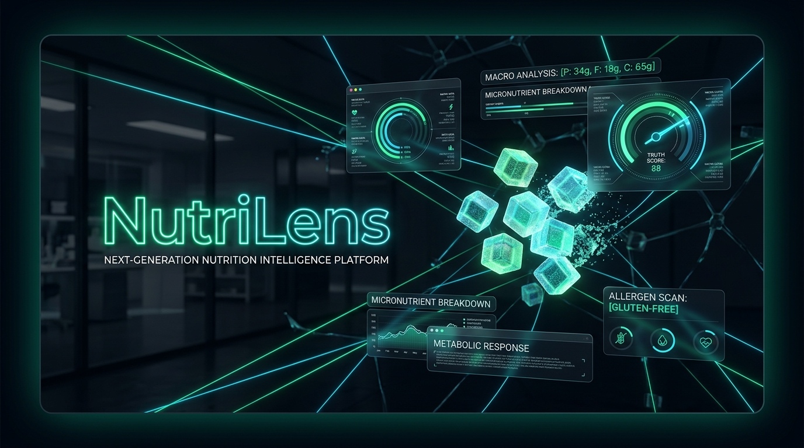
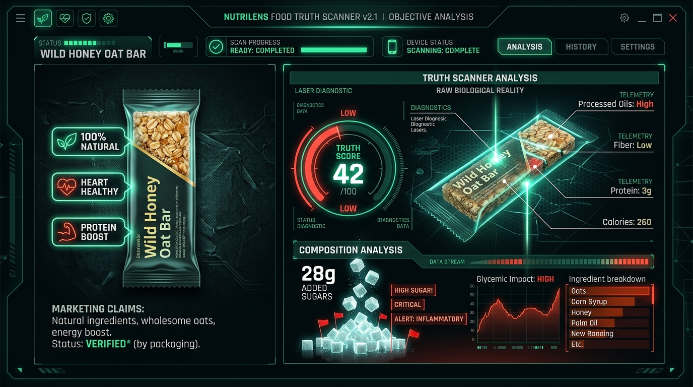

<div align="center">

# 🌿 NutriLens
### Next-Generation Nutrition Intelligence & Food Deception Decoder

[](https://nextjs.org/)
[](https://react.dev/)
[](https://www.typescriptlang.org/)
[](https://tailwindcss.com/)
[](https://ai.google.dev/)
[](https://fdc.nal.usda.gov/)
[](https://opensource.org/licenses/MIT)

<br />



<br />
<br />

**See past the health halo. Decode the nutritional reality behind food marketing with artificial intelligence.**

[Explore Live Demo](http://localhost:3000) • [Report Deception](https://github.com/nutrilens/nutrilens/issues) • [Request Feature](https://github.com/nutrilens/nutrilens/issues)

</div>

---

## 📑 Table of Contents

- [The Problem: The "Health Halo" Crisis](#-the-problem-the-health-halo-crisis)
- [Key Features](#-key-features)
  - [1. Instant AI Food Scanner](#1-instant-ai-food-scanner-food-insight)
  - [2. Food Face-Off Spectrometer](#2-food-face-off-spectrometer-compare)
  - [3. Interactive Label Detective HUD](#3-interactive-label-detective-hud-label-detective)
  - [4. Smart Swaps & Annual Impact Calculator](#4-smart-swaps--annual-impact-calculator-alternatives)
  - [5. Athlete MythBusters](#5-athlete-mythbusters-athletes)
  - [6. Sneaky Culprit Radar](#6-sneaky-culprit-radar-explore)
  - [7. Command Search Console (⌘K)](#7-command-search-console-k)
- [Visual Product Showcase](#-visual-product-showcase)
- [System Architecture](#-system-architecture)
- [Technology Stack](#-technology-stack)
- [Project Directory Structure](#-project-directory-structure)
- [Getting Started](#-getting-started)
  - [Prerequisites](#prerequisites)
  - [Installation](#installation)
  - [Environment Configuration](#environment-configuration)
  - [Running Development Server](#running-development-server)
  - [Production Build](#production-build)
- [Nutritional Methodology & Data Grounding](#-nutritional-methodology--data-grounding)
- [Contributing](#-contributing)
- [License & Disclaimer](#-license--disclaimer)

---

## 🛑 The Problem: The "Health Halo" Crisis

Food manufacturers spend over **$14 Billion annually** in packaging psychology to convince consumers that sugar-laden, highly processed foods are wholesome health foods.

| Marketing Claim on Front | Biochemical Reality on Back |
| :--- | :--- |
| **"Heart Healthy Whole Grain Granola"** | Packed with **28g of added sugar** (7 sugar cubes) and fractionated palm oil—nutritionally equivalent to a slice of chocolate cake. |
| **"French Vanilla Organic Greek Yogurt"** | Contains **24g of sugar**—exceeding an entire glazed jelly donut and canceling probiotic metabolic benefits. |
| **"Barista Edition Creamy Oat Milk"** | Processed with enzymatic hydrolysis producing high-GI maltose sugar and emulsified with rapeseed oil. |
| **"Garden Veggie Straws"** | 93% potato starch and salt with microscopic vegetable powders used purely for color tinting. |

**NutriLens** breaks through this marketing deception. By combining **USDA FoodData Central** biochemical metrics with the **Google Gemini 3.6 Flash Intelligence API**, NutriLens gives consumers instant, objective clarity on what is actually entering their bodies.

---

## ⚡ Key Features

### 1. Instant AI Food Scanner (`/food-insight`)
- **Neural Food Deconstruction**: Type any food, packaged product, or brand (e.g., *"Oatly Barista"*, *"Chobani Vanilla"*, *"Kind Bar"*).
- **Gemini 3.6 Flash Engine**: Evaluates ingredient lists and nutritional ratios via structured schema prompts.
- **Truth Score Gauge (0–100)**: Dynamic radial dial color-coded by health halo discrepancy (Green = Clean, Amber = Moderate Discrepancy, Rose = High Deception).
- **Claim vs. Reality Translator**: Extracts front-of-pack buzzwords (*"Gluten-Free"*, *"Non-GMO"*) and translates what they actually mean metabolically.
- **Micro-Nutrient Breakdown**: Highlights sugar, protein, fiber, sodium, and fat with actionable label-checking guidance.

### 2. Food Face-Off Spectrometer (`/compare`)
- **Direct Head-to-Head Showdowns**: Compare "perceived healthy" foods against truly nutritious alternatives across 8 categories (Dairy, Granola, Cereals, Beverages, Bread, Snacks, Protein, Energy).
- **Physical Sugar Cubes Visualizer**: Converts abstract grams into tangible 4-gram sugar cubes (🟫🟫🟫🟫🟫🟫 = 24g) and salt shakers.
- **Biochemical Delta Ratings**: Real-time superiority tags showing percentage advantages (*"72% Less Added Sugar"*, *"3× More Fiber"*).
- **Recharts Spectrometer**: Interactive grouped bar charts with theme-aware gradient fills, custom delta tooltips, and relative scales.

### 3. Interactive Label Detective HUD (`/label-detective`)
- **Interactive Nutrition HUD**: An FDA-standard Nutrition Facts simulator with clickable radar pins.
- **Hotspot Deep Dives**: Click Serving Size, Added Sugars, Sodium, Saturated Fats, or Ingredients to view real-world manufacturer manipulation tricks.
- **The Deception Challenge Mini-Game**: Interactive case file challenge (*"Artisan Wild Berry Fit-Crunch Bar"*) where users inspect clues, identify 3 deceptive loopholes, and submit their diagnosis.

### 4. Smart Swaps & Annual Impact Calculator (`/alternatives`)
- **1-to-1 Habit Swaps**: Practical food substitutions that preserve routine and taste while improving metabolic outcomes.
- **Interactive Annual Health Savings Calculator**:
  - Dynamically adjust weekly swap frequency (1 to 14 times per week).
  - Calculates **pounds of pure sugar eliminated annually** (e.g., `14.6 lbs/year`).
  - Estimates **empty calories avoided** (e.g., `43,800 kcal`).
  - Projects metabolic resilience and insulin sensitivity improvements.

### 5. Athlete MythBusters (`/athletes`)
- **Evidence-Based Sports Nutrition**: Debunks common fitness industry pseudo-science across Protein, Carbs, Hydration, Recovery, and Supplements.
- **"Tap-to-Bust" Cards**: Clean cards that flip/reveal scientific consensus, peer-reviewed clinical rationale, and actionable athlete protocols.

### 6. Sneaky Culprit Radar (`/explore`)
- **60+ Hidden Sugar Aliases**: Comprehensive directory exposing how manufacturers split sugars across ingredients (Maltodextrin, Evaporated Cane Juice, Dextrose, Brown Rice Syrup).
- **Fat & Sodium Traps**: Explains interesterified fats, fractionated palm kernel oil, and chemical preservatives.

### 7. Command Search Console (`⌘K`)
- **Instant Client-Side Fuzzy Search**: Press `⌘K` or `Ctrl+K` anywhere in the app to search across 100+ foods, comparison pairs, label terms, myths, and alternatives with zero network lag.

---

## 🖼️ Visual Product Showcase

<div align="center">



*NutriLens Food Truth Scanner v2.1 — Split view comparing front-of-package claims against laboratory biological reality.*

</div>

---

## 🏛️ System Architecture

NutriLens is built on the **Next.js 14 App Router** with full TypeScript validation, server-side Gemini AI orchestration, and client-side reactive visualizers.

```mermaid
flowchart TB
    subgraph Client["Client Layer (React 18 & Next.js App Router)"]
        UI[Glassmorphic UI / Tailwind CSS v4]
        Hero[Truth Scanner 2.0 Split View]
        HUD[Label Detective HUD & Mini-Game]
        Calc[Annual Health Savings Calculator]
        SearchModal[Fuzzy Search Engine (⌘K)]
    end

    subgraph Server["Next.js Route Handlers (Server-Side)"]
        APIFood["POST /api/food-insight"]
        APISearch["GET /api/search"]
        RateLimiter["In-Memory Sliding Window Rate Limiter"]
        InputValidator["Zod-Style Input & Schema Sanitizer"]
    end

    subgraph Intelligence["Data & Intelligence Engine"]
        Gemini["Google Gemini 3.6 Flash Model"]
        USDA["USDA FoodData Central Local Profiles"]
        Engine["Biochemical Rule Engine & Spectrometer"]
    end

    UI -->|Query /food-insight| APIFood
    UI -->|⌘K Query| APISearch
    APIFood --> RateLimiter
    RateLimiter --> InputValidator
    InputValidator -->|Structured Prompt| Gemini
    Gemini -->|Strict JSON Response| InputValidator
    InputValidator -->|Validated FoodInsightResponse| UI
    USDA --> Engine
    Engine --> Hero
    Engine --> HUD
    Engine --> Calc
```

---

## 🛠️ Technology Stack

| Layer | Technology | Purpose |
| :--- | :--- | :--- |
| **Framework** | [Next.js 14 (App Router)](https://nextjs.org/) | Server-side rendering, Route Handlers, optimized streaming |
| **Language** | [TypeScript 5](https://www.typescriptlang.org/) | Strict static typing, schema definitions, zero `any` policy |
| **Styling** | [Tailwind CSS v4](https://tailwindcss.com/) | Modern CSS variables, `@theme` tokens, glassmorphism |
| **AI Model** | [Google Gemini 3.6 Flash](https://ai.google.dev/) | Structured nutrition analysis, deception risk scoring |
| **Data Visualization** | [Recharts](https://recharts.org/) | Head-to-head nutrition spectrometer, macro deltas |
| **Icons** | [Lucide React](https://lucide.dev/) | Modern, clean iconography |
| **Theming** | [next-themes](https://github.com/pacocoursey/next-themes) | Dark mode, light mode, and system preference detection |
| **Dataset** | [USDA FoodData Central](https://fdc.nal.usda.gov/) | Ground-truth nutritional profiles and biochemical values |

---

## 📁 Project Directory Structure

```text
nutrilens/
├── public/
│   ├── images/
│   │   ├── banner.jpg                 # High-res hero showcase banner
│   │   └── truth_scanner.jpg          # Truth Scanner interface graphic
├── src/
│   ├── app/
│   │   ├── alternatives/
│   │   │   └── page.tsx               # Smart Swaps & Annual Calculator
│   │   ├── api/
│   │   │   ├── food-insight/
│   │   │   │   └── route.ts           # Gemini 3.6 Flash AI route handler
│   │   │   └── search/
│   │   │       └── route.ts           # Real-time search query endpoint
│   │   ├── athletes/
│   │   │   └── page.tsx               # Athlete MythBusters tap-to-bust
│   │   ├── compare/
│   │   │   └── page.tsx               # Food Face-Off Spectrometer
│   │   ├── explore/
│   │   │   └── page.tsx               # Sneaky Culprit Radar (60+ aliases)
│   │   ├── food-insight/
│   │   │   └── page.tsx               # AI Food Insight scanner & gauge
│   │   ├── label-detective/
│   │   │   └── page.tsx               # Label HUD & Deception Challenge
│   │   ├── globals.css                # Obsidian theme, scanlines, animations
│   │   ├── layout.tsx                 # Root layout with ambient glow mesh
│   │   └── page.tsx                   # Interactive Truth Scanner 2.0 Hero
│   ├── components/
│   │   ├── comparison/                # Spectrometer & macro comparison cards
│   │   ├── insight/                   # Truth Score dial & claim decoders
│   │   ├── label/                     # Nutrition HUD & interactive mini-game
│   │   ├── layout/                    # Full-width glass Navbar, Footer, Theme
│   │   ├── search/                    # SearchDialog command menu (⌘K)
│   │   └── ui/                        # Badges, PageHeaders, Error/Loading states
│   ├── data/                          # 9 USDA-grounded nutritional datasets
│   ├── hooks/                         # use-food-insight, use-comparison, use-search
│   ├── lib/                           # ai-client, nutrition-rules, search-engine
│   └── types/                         # TypeScript interfaces and response schemas
├── .env.local                         # Local environment keys (gitignored)
├── package.json
├── tsconfig.json
└── README.md
```

---

## 🚀 Getting Started

### Prerequisites

- **Node.js**: `v18.17.0` or higher
- **Package Manager**: `npm`, `yarn`, `pnpm`, or `bun`
- **Google Gemini API Key**: Free key from [Google AI Studio](https://aistudio.google.com/)

### Installation

1. **Clone the repository**:
   ```bash
   git clone https://github.com/nutrilens/nutrilens.git
   cd nutrilens
   ```

2. **Install dependencies**:
   ```bash
   npm install
   ```

### Environment Configuration

Create a `.env.local` file in the root directory:

```env
# Google Gemini API Key for NutriLens AI Food Scanner
GEMINI_API_KEY=your_gemini_api_key_here
```

> [!TIP]
> You can obtain a free Gemini API key in 30 seconds by visiting [aistudio.google.com/app/apikey](https://aistudio.google.com/app/apikey).

### Running Development Server

Start the Next.js development server:

```bash
npm run dev
```

Open [**http://localhost:3000**](http://localhost:3000) in your browser.

### Production Build

Verify strict type-checking and compile an optimized production build:

```bash
npm run build
npm run start
```

---

## 🔬 Nutritional Methodology & Data Grounding

NutriLens adheres strictly to clinical dietary benchmarks and peer-reviewed metabolic science:

1. **American Heart Association (AHA) Sugar Guidelines**:
   - Men: Maximum 36g (9 teaspoons / 9 cubes) of added sugar per day.
   - Women: Maximum 25g (6 teaspoons / 6 cubes) of added sugar per day.
   - Children: Maximum 24g (6 cubes) per day.
2. **FDA Daily Value Standards**:
   - Sodium: `< 2,300 mg/day`
   - Saturated Fat: `< 20 g/day` (based on 2,000 calorie diet)
   - Dietary Fiber: `≥ 28 g/day`
3. **USDA FoodData Central Integration**:
   - All pre-compiled baseline comparisons are indexed directly against verified standard reference nutrient records from the USDA Agricultural Research Service.

---

## 🤝 Contributing

Contributions to NutriLens are warmly welcomed!

1. Fork the Project
2. Create your Feature Branch (`git checkout -b feature/NewFoodDiagnostic`)
3. Commit your Changes (`git commit -m 'Add NewFoodDiagnostic module'`)
4. Push to the Branch (`git push origin feature/NewFoodDiagnostic`)
5. Open a Pull Request

---

## 📄 License & Disclaimer

Distributed under the **MIT License**. See `LICENSE` for more information.

> [!NOTE]
> **Educational Disclaimer**: NutriLens is an educational and analytical research tool designed to foster health literacy and critical thinking around nutritional marketing claims. It does not constitute formal medical or dietary advice. Always consult a licensed healthcare professional or registered dietitian regarding specific metabolic conditions.

<div align="center">
  <br />
  <sub>Crafted with precision for conscious eating. Powered by Google Gemini AI & USDA Open Data.</sub>
</div>
