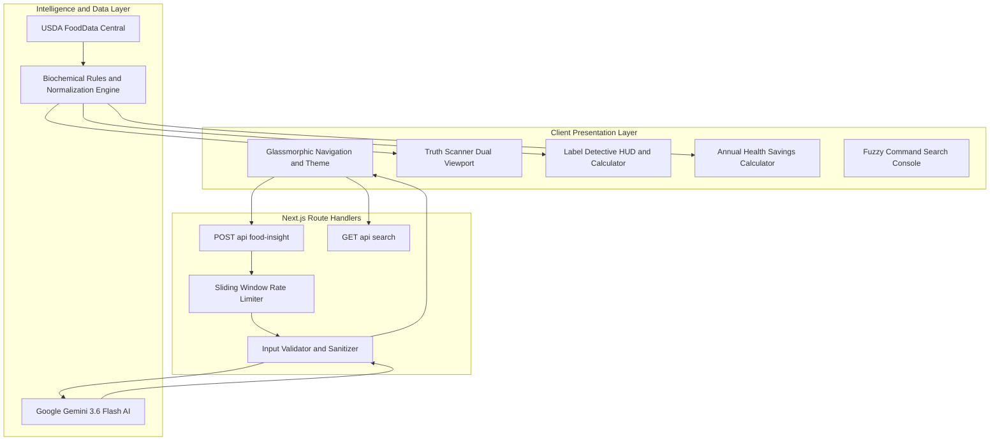

<a name="top"></a>
<div align="center">

# 🌿 NutriLens

### *Next-Generation Nutrition Intelligence & Health Halo Decoder*

Empowering consumers to look past deceptive food marketing, decode the "health halo," and understand the true biological impact of what they eat using artificial intelligence and USDA biochemical baselines.

<br />

[](https://nextjs.org/)
[](https://react.dev/)
[](https://www.typescriptlang.org/)
[](https://tailwindcss.com/)
[](https://ai.google.dev/)
[](https://fdc.nal.usda.gov/)
[](https://vercel.com/analytics)
[](https://vercel.com/docs/speed-insights)
[](https://opensource.org/licenses/MIT)

<br />

[](https://vercel.com/new/clone?repository-url=https://github.com/aadityashekhar321/nutrilens)

<br />

<a href="#-core-diagnostic-engines">
  
</a>

<br />
<br />

**[Explore Live Demo](https://github.com/aadityashekhar321/nutrilens) • [Report Deceptive Food](https://github.com/aadityashekhar321/nutrilens/issues) • [Request Feature](https://github.com/aadityashekhar321/nutrilens/issues) • [Read Clinical Science](#-clinical-methodology--regulatory-science)**

</div>

---

## 🧭 Table of Contents

- [⚡ The $14B Health Halo Problem](#-the-14b-health-halo-problem)
- [⚔️ Why NutriLens? (Competitive Matrix)](#️-why-nutrilens-competitive-matrix)
- [📸 Visual Interface Showcase](#-visual-interface-showcase)
- [🌟 Core Diagnostic Engines](#-core-diagnostic-engines)
  - [1. Truth Scanner 2.0](#1--truth-scanner-20-)
  - [2. Food Face-Off Spectrometer](#2-️-food-face-off-spectrometer-compare)
  - [3. AI Food Scanner](#3--ai-food-scanner-food-insight)
  - [4. Interactive Label Detective HUD](#4-️-interactive-label-detective-hud-label-detective)
  - [5. Smart Swaps Studio](#5--smart-swaps-studio-alternatives)
  - [6. Athlete MythBusters](#6--athlete-mythbusters-athletes)
  - [7. Sneaky Culprits Radar](#7--sneaky-culprits-radar-explore)
  - [8. Global Command Bar](#8-️-global-command-bar-k--ctrlk)
- [🔬 Clinical Methodology & Regulatory Science](#-clinical-methodology--regulatory-science)
- [🏛️ System Architecture](#️-system-architecture)
- [🛠️ Technology Stack](#️-technology-stack)
- [📂 Project Directory Structure](#-project-directory-structure)
- [🚀 Getting Started & Local Setup](#-getting-started--local-setup)
- [🗺️ Roadmap & Milestones](#️-roadmap--milestones)
- [🤝 Contributing](#-contributing)
- [📄 License & Disclaimer](#-license--disclaimer)

---

## ⚡ The $14B Health Halo Problem

Food conglomerates invest over **$14 Billion each year** crafting deceptive front-of-pack claims. By exploiting buzzwords like *"All-Natural"*, *"Multi-Grain"*, *"Immunity-Boosting"*, and *"Made with Real Fruit"*, industrial food processors create a psychological **"Health Halo"**—tricking well-intentioned consumers into purchasing ultra-processed desserts marketed as wellness staples.

```text
┌─────────────────────────────────────────────────────────────────────────────┐
│  FRONT-OF-BOX MARKETING CLAIM                                               │
│  "Artisan Honey Oat Protein Granola Bar" 🌿 (Greenwashed Packaging)       │
├─────────────────────────────────────────────────────────────────────────────┤
│  BIOCHEMICAL REALITY DECODED BY NUTRILENS                                   │
│  • Added Sugars: 28g  ──►  Equivalent to 7 PHYSICAL SUGAR CUBES (🟫🟫🟫🟫🟫🟫🟫) │
│  • Caloric Load: 350 kcal / 75g package                                    │
│  • Metabolic Equivalence: Matches an entire slice of glazed chocolate cake  │
└─────────────────────────────────────────────────────────────────────────────┘
```

**NutriLens** breaks the illusion. Grounded in **USDA FoodData Central** biochemical baselines and powered by the **Google Gemini 3.6 Flash AI Engine**, NutriLens calculates exact nutrient balances, normalizes misleading serving sizes to standardized 100g baselines, and flags regulatory loopholes in real-time.

---

## ⚔️ Why NutriLens? (Competitive Matrix)

| Capability / Feature | NutriLens | MyFitnessPal | Yuka | Fooducate |
| :--- | :---: | :---: | :---: | :---: |
| **Health Halo & Greenwashing Decoding** | ✅ **Native** | ❌ No | ⚠️ Basic Score | ⚠️ Limited |
| **100g Baseline Normalization** | ✅ **Instant Toggle** | ❌ No | ❌ No | ❌ No |
| **Generative AI Ingredient Analysis** | ✅ **Gemini 3.6 Flash** | ❌ No | ❌ No | ❌ No |
| **Portion Reality Multiplier (1x–2.5x)** | ✅ **Interactive** | ⚠️ Manual Log | ❌ No | ❌ No |
| **Tangible Sugar Cube Stacking Visuals** | ✅ **4g Cube Metaphor** | ❌ No | ❌ No | ❌ No |
| **FDA Regulatory Loophole Flagging** | ✅ **21 CFR 101** | ❌ No | ⚠️ Additives Only | ❌ No |
| **Compounding Annual Impact Calculator** | ✅ **Dynamic** | ❌ No | ❌ No | ❌ No |
| **Open Source & Zero Paywalls** | ✅ **100% Free / MIT** | ❌ $79/yr Sub | ❌ Premium Tier | ❌ Premium Tier |

---

## 📸 Visual Interface Showcase

<div align="center">


*Figure 1: NutriLens Truth Scanner 2.0 — Dual-split viewport contrasting marketing buzzwords against real biochemical impact.*

</div>

---

## 🌟 Core Diagnostic Engines

### 1. 🔍 Truth Scanner 2.0 (`/`)
- **Dual-Lens Viewport**: Interactive split slider allowing users to scrub between `🏷️ Marketing Claim`, `⚖️ 50/50 Split`, and `🔬 Lab Reality`.
- **Physical Sugar Cube Stacks**: Abstract grams of added sugar are instantly rendered as tangible 4-gram sugar cubes (e.g. 24g sugar = 🟫🟫🟫🟫🟫🟫 6 cubes) to build intuitive portion awareness.
- **Biochemical Telemetry Ticker**: Real-time ticker streaming clinical statistics, glycemic impact notes, and regulatory warning flags.

### 2. ⚖️ Food Face-Off Spectrometer (`/compare`)
- **Direct Head-to-Head Matchups**: Compare "perceived healthy" supermarket foods against genuinely superior whole-food alternatives across 8 core categories: *Dairy, Granola, Cereals, Beverages, Bread, Snacks, Protein, and Energy Foods*.
- **100g Baseline Normalization Toggle**: Effortlessly toggle between **"📦 As Stated on Box"** and **"⚖️ Standardized 100g Baseline"**. Exposes deceptive tricks where brands shrink serving sizes to 25g to make sugar numbers look artificially safe.
- **Dynamic Superiority Badges**: Computes percentage deltas in real time (*"+150% Superior Fiber"*, *"72% Less Added Sugar"*).
- **Recharts Spectrometer**: Interactive grouped bar charts with custom delta tooltips, relative macro scales, and theme-adaptive color-coding.

### 3. 🤖 AI Food Scanner (`/food-insight`)
- **Neural Food Deconstruction**: Submit any packaged supermarket food or beverage (*"Oatly Barista Edition Oat Milk"*, *"Chobani Vanilla Greek Yogurt"*, *"Kind Dark Chocolate Almond Bar"*).
- **Gemini 3.6 Flash Engine**: Evaluates ingredient formulations, glycemic spike risks, artificial emulsifiers, and hidden sodium loads.
- **Portion Reality Multiplier**: Toggle between `1.0x Stated Serving`, `1.5x Typical Bowl`, `2.0x Double Portion`, and `2.5x Entire Container` to recalculate nutrient grams and sugar cubes dynamically.
- **AHA Ceiling Alert**: Instantly triggers high-visibility warnings if your consumed portion exceeds the American Heart Association's recommended 25g daily added sugar ceiling.
- **Radial Truth Score Gauge (0–100)**: Animated circular SVG dial color-coded by deception risk (*Green = Clean, Amber = Moderate Discrepancy, Rose = High Deception*).

### 4. 🕵️ Interactive Label Detective HUD (`/label-detective`)
- **Nutrition Facts X-Ray**: Interactive FDA-standard Nutrition Facts panel featuring clickable inspection targets across all key macros.
- **Container Reality Math**: Click any line item to reveal the full-package impact (e.g., `140 kcal × 2.5 servings = 350 kcal` and `12g sugar × 2.5 = 30g container sugar / 7.5 physical cubes`).
- **Interactive Deception Challenge**: Step into the shoes of a food investigator inspecting case files (*"Artisan Wild Berry Fit-Crunch Bar"*), spot 3 hidden manufacturer loopholes, and test your label literacy.
- **5-Second Grocery Aisle Checklist**: Practical checklist with live mastery progress tracking and instant certification unlock.

### 5. 🔄 Smart Swaps Studio (`/alternatives`)
- **1-to-1 Habit Swaps**: Practical food substitutions that preserve daily convenience while drastically cutting glycemic spikes and industrial oils.
- **Compounding Annual Savings Calculator**:
  - Adjust weekly swap frequency dynamically from 1 to 14 times per week.
  - Computes **pounds of pure sugar eliminated annually** (e.g., `14.6 lbs/year`).
  - Converts savings into tangible analogies: **equivalent 12oz cans of soda purged** and **days of human resting metabolic energy spared**.
  - Highlights exact macro delta pills (`-18g Sugar`, `+6g Protein`, `+4g Fiber`) on every swap card.

### 6. 🥊 Athlete MythBusters (`/athletes`)
- **Sports Nutrition Evidence Base**: Debunks persistent fitness industry pseudo-science across *Protein Synthesis, Glycogen Replenishment, Hydration & Electrolytes, Recovery Windows, and Supplements*.
- **Instant Search & Bulk Actions**: Filter myths in real-time by keyword (`protein`, `cramps`, `electrolytes`, `timing`) or trigger `Bust All` to review every scientific reality at once.
- **Clinical Training Protocols**: Actionable, peer-reviewed advice for endurance athletes, strength training, and metabolic conditioning.

### 7. 🚨 Sneaky Culprits Radar (`/explore`)
- **60+ Hidden Sugar Aliases**: Search and filter through sneaky ingredient disguises (Maltodextrin, Dextrose, Evaporated Cane Juice, Agave Nectar, Barley Malt).
- **Intake Reality Gap Meter**: Visual meter contrasting safe clinical intake limits against the average consumer intake (e.g., 284% over safe limit for added sugar).

### 8. ⌨️ Global Command Bar (`⌘K` / `Ctrl+K`)
- **Instant Fuzzy Search**: Accessible from anywhere in the application.
- **Full Keyboard Navigation**: Use `ArrowUp`, `ArrowDown`, and `Enter` with highlighted query matches and instant route transitions.

---

## 🔬 Clinical Methodology & Regulatory Science

NutriLens grounds every insight in peer-reviewed clinical guidelines and official regulatory documentation:

```text
               ┌─────────────────────────────────────────────────────────┐
               │         GLOBAL NUTRITIONAL SCIENCE STANDARDS            │
               └────────────────────────────┬────────────────────────────┘
                                            │
         ┌──────────────────────────────────┼──────────────────────────────────┐
         ▼                                  ▼                                  ▼
┌──────────────────┐               ┌──────────────────┐               ┌──────────────────┐
│  AHA SUGAR CAPS  │               │ FDA 21 CFR 101.9 │               │   WHO SODIUM     │
│ Men:    36g/day  │               │ Trans Fat < 0.5g │               │ Ceiling:         │
│ Women:  25g/day  │               │ Loophole Exposed │               │ < 2,000 mg/day   │
│ Kids:   24g/day  │               │ Ingredient Split │               │ (5g pure salt)   │
└──────────────────┘               └──────────────────┘               └──────────────────┘
```

1. **American Heart Association (AHA) Added Sugar Standards**:
   - **Men**: Maximum 36g / 9 teaspoons (9 sugar cubes) daily.
   - **Women**: Maximum 25g / 6 teaspoons (6 sugar cubes) daily.
   - **Children**: Maximum 24g / 6 teaspoons daily.
2. **FDA 21 CFR 101 Regulatory Loopholes Exposed**:
   - **The 0.5g Trans Fat Loophole**: Products containing under 0.5g of trans fat per serving are legally permitted to claim *"0g Trans Fat"*. NutriLens flags hidden partially hydrogenated oils in the ingredient list.
   - **Ingredient Splitting**: Brands divide sugars across 4+ synonyms (dextrose, cane syrup, maltodextrin) so that whole oats or fruit appear first on the ingredient list.
3. **World Health Organization (WHO) Sodium Limits**:
   - Recommended daily sodium intake ceiling is `< 2,000 mg/day` (equivalent to approximately 5g of salt).

---

## 🏛️ System Architecture

NutriLens is engineered with the **Next.js 14 App Router**, featuring server-side Google Gemini AI orchestration, client-side reactive visualizers, and USDA open datasets.



---

## 🛠️ Technology Stack

| Layer | Technology | Version | Purpose |
| :--- | :--- | :--- | :--- |
| **Framework** | **Next.js** | `14.2.35` | App Router, Server Components, Route Handlers, Turbopack |
| **UI Library** | **React** | `18.3` | Reactive state management, client hydration, custom hooks |
| **Language** | **TypeScript** | `5.x` | Strict static typing, schema verification, zero `any` policy |
| **Styling** | **Tailwind CSS** | `v4.0` | Design tokens, CSS custom variables, glassmorphism |
| **AI Engine** | **Google Gemini** | `3.6 Flash` | Structured nutritional inference and health halo risk assessment |
| **Data Viz** | **Recharts** | `3.10` | Responsive SVG grouped bar charts and custom delta spectrometer |
| **Telemetry** | **Vercel Analytics**| `1.5.0` | Privacy-focused real-time visitor telemetry and page views |
| **Performance**| **Speed Insights** | `1.2.0` | Real User Monitoring (RUM) for Core Web Vitals (LCP, FID, CLS, INP) |
| **Icons** | **Lucide React** | Latest | Feather-weight SVG iconography |
| **Theming** | **next-themes** | Latest | System-aware dark, light, and obsidian mode toggle |
| **Data Baseline**| **USDA FoodData** | Official | USDA Agricultural Research Service nutritional profiles |

---

## 📂 Project Directory Structure

```text
nutrilens/
├── public/
│   ├── images/
│   │   ├── banner.jpg                 # 4K showcase banner
│   │   └── truth_scanner.jpg          # Truth Scanner interface visual
│   ├── file.svg
│   ├── globe.svg
│   └── next.svg
├── src/
│   ├── app/
│   │   ├── alternatives/page.tsx      # Smart Swaps & Compounding Calculator
│   │   ├── athletes/page.tsx          # Athlete MythBusters & Live Search
│   │   ├── compare/page.tsx           # Food Face-Off & 100g Normalizer
│   │   ├── explore/page.tsx           # Sneaky Culprits & Alias Filter
│   │   ├── food-insight/page.tsx      # AI Food Scanner & Telemetry HUD
│   │   ├── label-detective/page.tsx   # Label Detective HUD & Checklist
│   │   ├── api/
│   │   │   ├── food-insight/route.ts  # Gemini AI rate-limited route handler
│   │   │   └── search/route.ts        # Instant fuzzy search endpoint
│   │   ├── globals.css                # Obsidian theme, scanlines, animations
│   │   ├── layout.tsx                 # Root layout with Vercel Analytics & Navbar
│   │   └── page.tsx                   # Truth Scanner 2.0 Hero & Bento Grid
│   ├── components/
│   │   ├── alternatives/              # AlternativeCard & macro upgrade badges
│   │   ├── comparison/                # NutritionChart, ComparisonCard, Toggles
│   │   ├── education/                 # CulpritCard, LabelTermCard, MythCard
│   │   ├── insight/                   # FoodInsightForm, InsightResult, Gauge
│   │   ├── label/                     # LabelSimulator, DeceptionChallenge, Checklist
│   │   ├── layout/                    # Full-width glass Navbar, Footer, ThemeToggle
│   │   ├── search/                    # SearchDialog (keyboard navigation)
│   │   └── ui/                        # Badge, PageHeader, Error/Loading states
│   ├── data/                          # 9 USDA-grounded nutritional datasets
│   ├── hooks/                         # use-comparison, use-food-insight, use-search
│   ├── lib/                           # ai-client, comparison-engine, rules
│   └── types/                         # TypeScript interfaces and response schemas
├── .env.example                       # Environment template for developers
├── package.json
├── tsconfig.json
└── README.md
```

---

## 🚀 Getting Started & Local Setup

### Prerequisites
- **Node.js**: `v18.17.0` or higher
- **Package Manager**: `npm`, `pnpm`, or `yarn`
- **Google Gemini API Key**: Free key from [Google AI Studio](https://aistudio.google.com/apikey)

### 1. Clone the Repository
```bash
git clone https://github.com/aadityashekhar321/nutrilens.git
cd nutrilens
```

### 2. Install Dependencies
```bash
npm install
```

### 3. Configure Environment Variables
Copy the `.env.example` template to `.env.local`:
```bash
cp .env.example .env.local
```

Open `.env.local` and add your Google Gemini API key:
```env
GEMINI_API_KEY=your_gemini_api_key_here
```

### 4. Run Development Server
```bash
npm run dev
```

Open your browser and navigate to [**http://localhost:3000**](http://localhost:3000).

### 5. Build for Production
```bash
npm run build
npm run start
```

---

## 🗺️ Roadmap & Milestones

- [x] **v1.0.0 — Foundation Release**
  - [x] Truth Scanner 2.0 with Dual-Viewport scrubbing.
  - [x] 100g Baseline Normalization toggle for honest head-to-head comparisons.
  - [x] AI Food Scanner powered by Google Gemini 3.6 Flash.
  - [x] Portion Reality Multiplier (1.0x to 2.5x) with live sugar cube recalculation.
  - [x] Compounding Annual Sugar Savings Calculator.
  - [x] Vercel Web Analytics integration.
- [ ] **v1.1.0 — Visual Barcode Ingestion**
  - [ ] WebRTC camera barcode scanning for instant UPC lookup against Open Food Facts.
  - [ ] Automatic camera framing and barcode validation audio cue.
- [ ] **v1.2.0 — Bioavailability & Micro-Nutrients**
  - [ ] Micronutrient bioavailability score (heme vs non-heme iron, calcium inhibitors).
  - [ ] Ultra-processed food classification via the clinical NOVA 4 framework.
- [ ] **v2.0.0 — Community Deception Bounties**
  - [ ] Community submissions of deceptive grocery products with photo proof.
  - [ ] Crowdsourced label audit consensus and verified badge awards.

---

## 🤝 Contributing

Contributions are what make the open-source community an incredible place to learn, inspire, and create. Any contributions you make are **greatly appreciated**!

1. Fork the Repository
2. Create your Feature Branch:
   ```bash
   git checkout -b feature/AmazingDiagnostic
   ```
3. Commit your Changes:
   ```bash
   git commit -m "feat: Add AmazingDiagnostic tool"
   ```
4. Push to the Branch:
   ```bash
   git push origin feature/AmazingDiagnostic
   ```
5. Open a Pull Request

---

## 📄 License & Disclaimer

Distributed under the **MIT License**. See `LICENSE` for more information.

> [!NOTE]
> **Clinical & Educational Disclaimer**: NutriLens is an educational and analytical research tool designed to foster public health literacy and critical thinking around food marketing claims. It does not constitute formal medical or dietary diagnosis. Always consult a certified healthcare professional or registered dietitian regarding specific clinical conditions.

---

<div align="center">

**NutriLens** • Built with ❤️ by [Aaditya Shekhar](https://github.com/aadityashekhar321)  
<sub>Empowering consumers with objective food intelligence. Powered by Google Gemini AI & USDA Open Data.</sub>

<br />

<a href="#top"><b>Back to top ↑</b></a>

</div>
