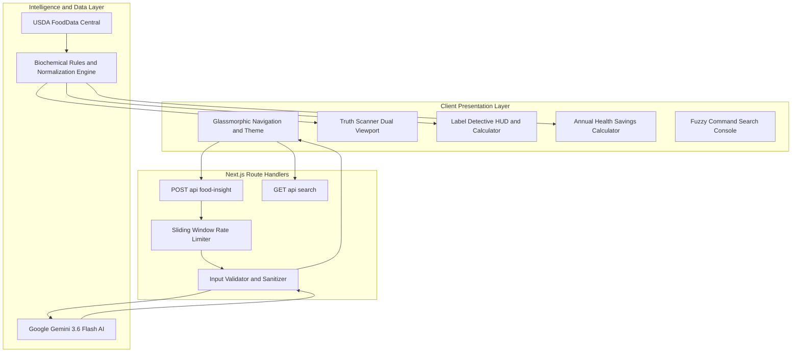

<a name="top"></a>
<div align="center">


# 🌿 NutriLens

<p align="center">
  
</p>

**The open-source nutritional intelligence engine that decodes misleading marketing claims, translates abstract grams into tangible physical sugar cubes, and exposes biochemical reality.**

<br />

<!-- ACTION BUTTONS -->
<p align="center">
  <a href="https://github.com/aadityashekhar321/nutrilens"></a>
  <a href="https://vercel.com/new/clone?repository-url=https://github.com/aadityashekhar321/nutrilens"></a>
  <a href="#-getting-started--local-setup"></a>
  <a href="https://github.com/aadityashekhar321/nutrilens/issues"></a>
</p>

<!-- SHIELDS BADGE RIBBON -->
<p align="center">
  <a href="https://nextjs.org/"></a>
  <a href="https://react.dev/"></a>
  <a href="https://www.typescriptlang.org/"></a>
  <a href="https://tailwindcss.com/"></a>
  <a href="https://ai.google.dev/"></a>
  <a href="https://fdc.nal.usda.gov/"></a>
  <a href="https://vercel.com/analytics"></a>
  <a href="https://vercel.com/docs/speed-insights"></a>
  <a href="https://opensource.org/licenses/MIT"></a>
</p>

<br />

<!-- 4K HERO BANNER -->
<a href="#-core-diagnostic-engines">
  
</a>

<br />

</div>

---

<details open>
<summary><kbd>📖 Table of Contents (Click to collapse / expand)</kbd></summary>

- [⚡ The $14B Health Halo Problem](#-the-14b-health-halo-problem)
- [⚔️ Why NutriLens? (Competitive Matrix)](#️-why-nutrilens-competitive-matrix)
- [🔄 How It Works (4-Stage Pipeline)](#-how-it-works-4-stage-pipeline)
- [📸 Visual Interface Showcase](#-visual-interface-showcase)
- [🌟 Core Diagnostic Engines (Bento Grid)](#-core-diagnostic-engines)
  - [1. Truth Scanner 2.0](#1--truth-scanner-20-)
  - [2. Food Face-Off Spectrometer](#2-️-food-face-off-spectrometer-compare)
  - [3. AI Food Scanner](#3--ai-food-scanner-food-insight)
  - [4. Interactive Label Detective HUD](#4-️-interactive-label-detective-hud-label-detective)
  - [5. Smart Swaps Studio](#5--smart-swaps-studio-alternatives)
  - [6. Athlete MythBusters](#6--athlete-mythbusters-athletes)
  - [7. Sneaky Culprits Radar](#7--sneaky-culprits-radar-explore)
  - [8. Global Command Bar](#8-️-global-command-bar-k--ctrlk)
- [🧬 Sample Neural Food Output (JSON)](#-sample-neural-food-output)
- [🔬 Clinical Methodology & Regulatory Science](#-clinical-methodology--regulatory-science)
- [🏛️ System Architecture](#️-system-architecture)
- [🛠️ Technology Stack](#️-technology-stack)
- [📂 Project Directory Structure](#-project-directory-structure)
- [🚀 Getting Started & Local Setup](#-getting-started--local-setup)
- [🗺️ Roadmap & Milestones](#️-roadmap--milestones)
- [⭐ Stargazers Over Time](#-stargazers-over-time)
- [🤝 Contributing](#-contributing)
- [📄 License & Clinical Disclaimer](#-license--clinical-disclaimer)

</details>

---

## ⚡ The $14B Health Halo Problem

Food conglomerates invest over **$14 Billion annually** in sensory marketing, earthy kraft-paper packaging, and greenwashed buzzwords. By exploiting terms like *"Natural"*, *"Multi-Grain"*, *"Immunity-Boosting"*, and *"Made with Real Fruit"*, brands create a psychological **"Health Halo"** that persuades consumers to buy ultra-processed desserts masquerading as daily wellness essentials.

```text
┌──────────────────────────────────────────────────────────────────────────────────┐
│  FRONT-OF-BOX MARKETING CLAIM                                                    │
│  "Artisan Honey Oat Protein Bar" 🌿 (Greenwashed Packaging)                      │
├──────────────────────────────────────────────────────────────────────────────────┤
│  BIOCHEMICAL REALITY UNMASKED BY NUTRILENS                                       │
│  • Added Sugars: 28g  ──►  7 PHYSICAL SUGAR CUBES (🟫 🟫 🟫 🟫 🟫 🟫 🟫)           │
│  • Caloric Load: 350 kcal / 75g package (Not the advertised 35g serving!)        │
│  • Blood Glucose Impact: Equivalent to an entire slice of glazed chocolate cake  │
│  • Regulatory Loophole: Ingredient splitting masks sugar as the #1 ingredient    │
└──────────────────────────────────────────────────────────────────────────────────┘
```

**NutriLens** is the antidote. Grounded in **USDA FoodData Central** biochemical baselines and driven by **Google Gemini 3.6 Flash**, NutriLens calculates exact nutrient balances, normalizes misleading serving sizes to standardized 100g baselines, and flags regulatory loopholes in milliseconds.

---

## ⚔️ Why NutriLens? (Competitive Matrix)

Most existing nutrition apps are glorified barcode scanners designed to trap users into tedious calorie-logging subscriptions. NutriLens was built from the ground up as an **objective intelligence and public health literacy platform**.

| Capability / Feature | 🌿 NutriLens | MyFitnessPal | Yuka | Fooducate |
| :--- | :---: | :---: | :---: | :---: |
| **Health Halo & Greenwashing Decoding** | ✅ **Native Engine** | ❌ None | ⚠️ Basic 0-100 Score | ⚠️ Letter Grades Only |
| **100g Baseline Normalization** | ✅ **1-Click Toggle** | ❌ No | ❌ No | ❌ No |
| **Generative AI Ingredient Audit** | ✅ **Gemini 3.6 Flash** | ❌ No | ❌ No | ❌ No |
| **Portion Reality Multiplier (1x–2.5x)** | ✅ **Interactive HUD** | ⚠️ Manual Typing | ❌ No | ❌ No |
| **Tangible Sugar Cube Stacking Visuals** | ✅ **4g Cube Metaphor** | ❌ No | ❌ No | ❌ No |
| **FDA 21 CFR Loophole Auditing** | ✅ **Automated Flags** | ❌ No | ⚠️ Additives Only | ❌ No |
| **Compounding Annual Impact Calculator**| ✅ **Live Formula** | ❌ No | ❌ No | ❌ No |
| **Core Web Vitals & Real-Time RUM** | ✅ **Vercel Analytics**| ❌ Ad Tracking | ❌ Analytics Only | ❌ Ad Tracking |
| **Zero Paywalls & 100% Open Source** | ✅ **MIT License** | ❌ $79.99/yr Paywall | ❌ Premium Subscription | ❌ Premium Subscription |

---

## 🔄 How It Works (4-Stage Pipeline)

<table width="100%">
  <thead>
    <tr>
      <th width="25%" align="center"><b>1. 📥 Ingestion & Parsing</b></th>
      <th width="25%" align="center"><b>2. 🧠 Neural Audit</b></th>
      <th width="25%" align="center"><b>3. ⚖️ Biochemical Baseline</b></th>
      <th width="25%" align="center"><b>4. 💡 Empower & Swap</b></th>
    </tr>
  </thead>
  <tbody>
    <tr>
      <td align="left" valign="top">
        • Instant text input or category selection<br/>
        • Query normalization & XSS sanitizer<br/>
        • In-memory sliding window rate-limiter
      </td>
      <td align="left" valign="top">
        • <b>Google Gemini 3.6 Flash</b> engine<br/>
        • Deconstructs 60+ hidden sugar aliases<br/>
        • Evaluates glycemic spike hazards<br/>
        • Cross-references AHA daily thresholds
      </td>
      <td align="left" valign="top">
        • <b>USDA FoodData Central</b> baselines<br/>
        • 100g standardized normalization<br/>
        • Full-container reality multipliers<br/>
        • Flags FDA 21 CFR 101 loopholes
      </td>
      <td align="left" valign="top">
        • Tangible 4g sugar cube visualizations<br/>
        • Annual sugar cut & soda can analogies<br/>
        • 1-to-1 habit-preserving smart upgrades<br/>
        • Evidence-based sports nutrition
      </td>
    </tr>
  </tbody>
</table>

---

## 📸 Visual Interface Showcase

<div align="center">


*Figure 1: NutriLens Truth Scanner 2.0 — Dual-split viewport contrasting marketing buzzwords against real biochemical impact.*

</div>

---

## 🌟 Core Diagnostic Engines

<table width="100%">
  <tr>
    <td width="50%" valign="top">
      <h3>🔍 Truth Scanner 2.0 (<code>/</code>)</h3>
      <p><b>Interactive dual-viewport slider exposing deceptive front-of-pack claims.</b></p>
      <ul>
        <li><b>Dual-Lens Scrubbing:</b> Real-time scrubbing between <code>🏷️ Marketing Claim</code>, <code>⚖️ 50/50 Split</code>, and <code>🔬 Lab Reality</code> presets.</li>
        <li><b>Physical Sugar Cube Stacks:</b> Translates abstract grams into visual 4-gram sugar cubes (e.g. 24g sugar = 🟫🟫🟫🟫🟫🟫 6 physical cubes).</li>
        <li><b>Biochemical Telemetry Ticker:</b> Live streaming marquee showcasing clinical stats, glycemic impact notes, and regulatory warning flags.</li>
      </ul>
    </td>
    <td width="50%" valign="top">
      <h3>⚖️ Food Face-Off Spectrometer (<code>/compare</code>)</h3>
      <p><b>Head-to-head comparison engine with honest 100g baseline normalization.</b></p>
      <ul>
        <li><b>100g Baseline Normalizer:</b> Eliminates manufacturer tricks of shrinking serving sizes to 25g to make sugar numbers look artificially safe.</li>
        <li><b>8 Food Categories:</b> Head-to-head matchups across Dairy, Granola, Cereals, Beverages, Bread, Snacks, Protein, and Energy Foods.</li>
        <li><b>Recharts Spectrometer:</b> Grouped delta bar charts with automated superiority score badges (<i>"+150% Superior Fiber"</i>).</li>
      </ul>
    </td>
  </tr>
  <tr>
    <td width="50%" valign="top">
      <h3>🤖 AI Food Scanner (<code>/food-insight</code>)</h3>
      <p><b>Neural food deconstruction powered by Google Gemini 3.6 Flash.</b></p>
      <ul>
        <li><b>Any Food Search:</b> Queries real packaged products, brand ingredients, and complex formulations (*"Oatly Barista"*, *"Chobani Vanilla"*).</li>
        <li><b>Portion Reality Multiplier:</b> Scale between <code>1.0x</code>, <code>1.5x</code>, <code>2.0x</code>, and <code>2.5x</code> with dynamic macro recalculation.</li>
        <li><b>AHA Ceiling Warning:</b> Alerts when portion exceeds the American Heart Association's 25g daily added sugar maximum.</li>
        <li><b>Radial Truth Gauge:</b> Animated 0–100 deception dial with color-coded risk alerts (*Clean, Moderate, High Deception*).</li>
      </ul>
    </td>
    <td width="50%" valign="top">
      <h3>🕵️ Label Detective HUD (<code>/label-detective</code>)</h3>
      <p><b>Interactive FDA Nutrition Facts panel with container reality math.</b></p>
      <ul>
        <li><b>Interactive X-Ray:</b> Clickable inspect zones across Serving Size, Sugars, Fats, and Sodium.</li>
        <li><b>Container Reality Math:</b> Instant full-package multiplier (e.g. <code>140 kcal × 2.5 servings = 350 kcal</code> and <code>12g sugar × 2.5 = 30g total / 7.5 cubes</code>).</li>
        <li><b>Deception Challenge:</b> Gamified case file auditing 3 hidden manufacturer tricks.</li>
        <li><b>Aisle Checklist:</b> 5-second grocery checklist with live mastery progress tracking.</li>
      </ul>
    </td>
  </tr>
  <tr>
    <td width="50%" valign="top">
      <h3>🔄 Smart Swaps Studio (<code>/alternatives</code>)</h3>
      <p><b>1-to-1 food upgrades with compounding annual health savings.</b></p>
      <ul>
        <li><b>Compounding Calculator:</b> Adjust weekly frequency (1–14x/wk) to calculate annual sugar and caloric cut.</li>
        <li><b>Tangible Analogies:</b> Visualizes pounds of pure sugar purged (e.g. <code>14.6 lbs/year</code>), 12oz soda cans avoided, and metabolic rest days spared.</li>
        <li><b>Delta Macro Pills:</b> Highlights exact net savings (<code>-18g Sugar</code>, <code>+6g Protein</code>, <code>+4g Fiber</code>).</li>
      </ul>
    </td>
    <td width="50%" valign="top">
      <h3>🥊 Athlete MythBusters (<code>/athletes</code>)</h3>
      <p><b>Evidence-based debunking of sports nutrition pseudo-science.</b></p>
      <ul>
        <li><b>Peer-Reviewed Rigor:</b> Covers Protein Synthesis, Glycogen Replenishment, Hydration & Electrolytes, and Recovery Windows.</li>
        <li><b>Instant Filter & Search:</b> Real-time keyword filter (<code>protein</code>, <code>cramps</code>, <code>timing</code>) and <i>"Bust All"</i> bulk inspection.</li>
        <li><b>Clinical Protocols:</b> Actionable sports science for strength, endurance, and metabolic conditioning.</li>
      </ul>
    </td>
  </tr>
  <tr>
    <td width="50%" valign="top">
      <h3>🚨 Sneaky Culprits Radar (<code>/explore</code>)</h3>
      <p><b>Catalog of 60+ hidden sugar aliases and clinical limits.</b></p>
      <ul>
        <li><b>60+ Alias Library:</b> Exposes Maltodextrin, Dextrose, Cane Juice, Agave, Barley Malt, and Fruit Juice Concentrates.</li>
        <li><b>Intake Gap Visualizer:</b> Bar meter comparing safe clinical limits against standard consumer intake (284% over safe limit).</li>
      </ul>
    </td>
    <td width="50%" valign="top">
      <h3>⌨️ Global Command Console (<code>⌘K</code> / <code>Ctrl+K</code>)</h3>
      <p><b>Instant fuzzy search accessible anywhere across the platform.</b></p>
      <ul>
        <li><b>Full Keyboard Navigation:</b> Instant arrow key navigation (<code>ArrowUp</code> / <code>ArrowDown</code> / <code>Enter</code>).</li>
        <li><b>Universal Index:</b> Instant routing across foods, head-to-head comparisons, myths, and label terms.</li>
      </ul>
    </td>
  </tr>
</table>

---

## 🧬 Sample Neural Food Output

<details>
<summary><b>🔍 Inspect Sample Gemini 3.6 Flash Neural Analysis Payload (Click to expand)</b></summary>

```json
{
  "foodName": "Artisan Honey Oat Protein Granola Bar",
  "brand": "Nature's Promise",
  "truthScore": 38,
  "deceptionRisk": "high",
  "marketingClaims": [
    "All-Natural Whole Grain Goodness",
    "Excellent Source of Protein (10g)",
    "Immunity-Supporting Zinc & Vitamin C"
  ],
  "biochemicalReality": {
    "statedServingGrams": 40,
    "actualPackageGrams": 80,
    "containerServings": 2.0,
    "addedSugarGrams": 24,
    "sugarCubesEquivalent": 6,
    "ahaDailyLimitPercent": 96.0,
    "primarySweetener": "Brown Rice Syrup (High Glycemic Index: 98)",
    "regulatoryLoopholesIdentified": [
      "Ingredient Splitting: Brown rice syrup, cane sugar, and honey listed separately to keep rolled oats as #1 ingredient.",
      "Serving Size Manipulation: 40g serving size on an 80g bar that is universally consumed in one sitting."
    ]
  },
  "smartSwapAlternative": {
    "name": "Toasted Rolled Oats with Crushed Walnuts & Ceylon Cinnamon",
    "netSugarReduction": "20g (5 fewer sugar cubes)",
    "netFiberIncrease": "+4g"
  }
}
```

</details>

---

## 🔬 Clinical Methodology & Regulatory Science

NutriLens grounds every insight in peer-reviewed clinical guidelines and official regulatory documentation:

```text
               ┌─────────────────────────────────────────────────────────┐
               │         GLOBAL NUTRITIONAL SCIENCE STANDARDS            │
               └────────────────────────────┬────────────────────────────┘
                                            │
         ┌──────────────────────────────────┼──────────────────────────────────┐
         ▼                                  ▼                                  ▼
┌──────────────────┐               ┌──────────────────┐               ┌──────────────────┐
│  AHA SUGAR CAPS  │               │ FDA 21 CFR 101.9 │               │   WHO SODIUM     │
│ Men:    36g/day  │               │ Trans Fat < 0.5g │               │ Ceiling:         │
│ Women:  25g/day  │               │ Loophole Exposed │               │ < 2,000 mg/day   │
│ Kids:   24g/day  │               │ Ingredient Split │               │ (5g pure salt)   │
└──────────────────┘               └──────────────────┘               └──────────────────┘
```

1. **American Heart Association (AHA) Added Sugar Standards**:
   - **Men**: Maximum 36g / 9 teaspoons (9 sugar cubes) daily.
   - **Women**: Maximum 25g / 6 teaspoons (6 sugar cubes) daily.
   - **Children**: Maximum 24g / 6 teaspoons daily.
2. **FDA 21 CFR 101 Regulatory Loopholes Exposed**:
   - **The 0.5g Trans Fat Loophole**: Products containing under 0.5g of trans fat per serving are legally permitted to claim *"0g Trans Fat"*. NutriLens flags hidden partially hydrogenated oils in the ingredient list.
   - **Ingredient Splitting**: Brands divide sugars across 4+ synonyms (dextrose, cane syrup, maltodextrin) so that whole oats or fruit appear first on the ingredient list.
3. **World Health Organization (WHO) Sodium Limits**:
   - Recommended daily sodium intake ceiling is `< 2,000 mg/day` (equivalent to approximately 5g of salt).

---

## 🏛️ System Architecture

NutriLens is engineered on the **Next.js 14 App Router**, featuring server-side Google Gemini AI orchestration, client-side reactive visualizers, and USDA open datasets.



---

## 🛠️ Technology Stack

| Layer | Technology | Version | Purpose |
| :--- | :--- | :--- | :--- |
| **Framework** | **Next.js** | `14.2.35` | App Router, Server Components, Route Handlers, Turbopack |
| **UI Library** | **React** | `18.3` | Reactive state management, client hydration, custom hooks |
| **Language** | **TypeScript** | `5.x` | Strict static typing, schema verification, zero `any` policy |
| **Styling** | **Tailwind CSS** | `v4.0` | Modern tokens, CSS custom properties, glassmorphism |
| **AI Engine** | **Google Gemini** | `3.6 Flash` | Structured nutritional inference and health halo risk assessment |
| **Data Viz** | **Recharts** | `3.10` | Responsive SVG grouped bar charts and custom delta spectrometer |
| **Telemetry** | **Vercel Analytics**| `1.5.0` | Privacy-focused real-time visitor telemetry and page views |
| **Performance**| **Speed Insights** | `1.2.0` | Real User Monitoring (RUM) for Core Web Vitals (LCP, FID, CLS, INP) |
| **Icons** | **Lucide React** | Latest | Feather-weight SVG iconography |
| **Theming** | **next-themes** | Latest | System-aware dark, light, and obsidian mode toggle |
| **Data Baseline**| **USDA FoodData** | Official | USDA Agricultural Research Service nutritional profiles |

---

## 📂 Project Directory Structure

```text
nutrilens/
├── public/
│   ├── images/
│   │   ├── banner.jpg                 # 4K showcase banner
│   │   └── truth_scanner.jpg          # Truth Scanner interface visual
│   ├── file.svg
│   ├── globe.svg
│   └── next.svg
├── src/
│   ├── app/
│   │   ├── alternatives/page.tsx      # Smart Swaps & Compounding Calculator
│   │   ├── athletes/page.tsx          # Athlete MythBusters & Live Search
│   │   ├── compare/page.tsx           # Food Face-Off & 100g Normalizer
│   │   ├── explore/page.tsx           # Sneaky Culprits & Alias Filter
│   │   ├── food-insight/page.tsx      # AI Food Scanner & Telemetry HUD
│   │   ├── label-detective/page.tsx   # Label Detective HUD & Checklist
│   │   ├── api/
│   │   │   ├── food-insight/route.ts  # Gemini AI rate-limited route handler
│   │   │   └── search/route.ts        # Instant fuzzy search endpoint
│   │   ├── globals.css                # Obsidian theme, scanlines, animations
│   │   ├── layout.tsx                 # Root layout with Vercel Analytics & Speed Insights
│   │   └── page.tsx                   # Truth Scanner 2.0 Hero & Bento Grid
│   ├── components/
│   │   ├── alternatives/              # AlternativeCard & macro upgrade badges
│   │   ├── comparison/                # NutritionChart, ComparisonCard, Toggles
│   │   ├── education/                 # CulpritCard, LabelTermCard, MythCard
│   │   ├── insight/                   # FoodInsightForm, InsightResult, Gauge
│   │   ├── label/                     # LabelSimulator, DeceptionChallenge, Checklist
│   │   ├── layout/                    # Full-width glass Navbar, Footer, ThemeToggle
│   │   ├── search/                    # SearchDialog (keyboard navigation)
│   │   └── ui/                        # Badge, PageHeader, Error/Loading states
│   ├── data/                          # 9 USDA-grounded nutritional datasets
│   ├── hooks/                         # use-comparison, use-food-insight, use-search
│   ├── lib/                           # ai-client, comparison-engine, rules
│   └── types/                         # TypeScript interfaces and response schemas
├── .env.example                       # Environment template for developers
├── package.json
├── tsconfig.json
└── README.md
```

---

## 🚀 Getting Started & Local Setup

### Prerequisites
- **Node.js**: `v18.17.0` or higher
- **Package Manager**: `npm`, `pnpm`, or `yarn`
- **Google Gemini API Key**: Free key from [Google AI Studio](https://aistudio.google.com/apikey)

### 1. Clone the Repository
```bash
git clone https://github.com/aadityashekhar321/nutrilens.git
cd nutrilens
```

### 2. Install Dependencies
```bash
npm install
```

### 3. Configure Environment Variables
Copy the `.env.example` template to `.env.local`:
```bash
cp .env.example .env.local
```

Open `.env.local` and add your Google Gemini API key:
```env
GEMINI_API_KEY=your_gemini_api_key_here
```

### 4. Run Development Server
```bash
npm run dev
```

Open your browser and navigate to [**http://localhost:3000**](http://localhost:3000).

### 5. Build for Production
```bash
npm run build
npm run start
```

---

## 🗺️ Roadmap & Milestones

- [x] **v1.0.0 — Foundation & Truth Scanner Release**
  - [x] Truth Scanner 2.0 with Dual-Viewport scrubbing.
  - [x] 100g Baseline Normalization toggle for honest head-to-head comparisons.
  - [x] AI Food Scanner powered by Google Gemini 3.6 Flash.
  - [x] Portion Reality Multiplier (1.0x to 2.5x) with live sugar cube recalculation.
  - [x] Compounding Annual Sugar Savings Calculator.
  - [x] Vercel Web Analytics & Speed Insights Real User Monitoring.
- [ ] **v1.1.0 — Visual Barcode Ingestion**
  - [ ] WebRTC camera barcode scanning for instant UPC lookup against Open Food Facts.
  - [ ] Automatic camera framing and barcode validation audio cue.
- [ ] **v1.2.0 — Bioavailability & Micro-Nutrients**
  - [ ] Micronutrient bioavailability score (heme vs non-heme iron, calcium inhibitors).
  - [ ] Ultra-processed food classification via the clinical NOVA 4 framework.
- [ ] **v2.0.0 — Community Deception Bounties**
  - [ ] Community submissions of deceptive grocery products with photo proof.
  - [ ] Crowdsourced label audit consensus and verified badge awards.

---

## ⭐ Stargazers Over Time

[](https://star-history.com/#aadityashekhar321/nutrilens&Date)

---

## 🤝 Contributing

Contributions are what make the open-source community an incredible place to learn, inspire, and create. Any contributions you make are **greatly appreciated**!

1. Fork the Repository
2. Create your Feature Branch:
   ```bash
   git checkout -b feature/AmazingDiagnostic
   ```
3. Commit your Changes:
   ```bash
   git commit -m "feat: Add AmazingDiagnostic tool"
   ```
4. Push to the Branch:
   ```bash
   git push origin feature/AmazingDiagnostic
   ```
5. Open a Pull Request

---

## 📄 License & Clinical Disclaimer

Distributed under the **MIT License**. See `LICENSE` for more information.

> [!NOTE]
> **Clinical & Educational Disclaimer**: NutriLens is an educational and analytical research tool designed to foster public health literacy and critical thinking around food marketing claims. It does not constitute formal medical or dietary diagnosis. Always consult a certified healthcare professional or registered dietitian regarding specific clinical conditions.

---

<div align="center">

**NutriLens** • Engineered with ❤️ by [Aaditya Shekhar](https://github.com/aadityashekhar321)  
<sub>Empowering consumers with objective food intelligence. Powered by Google Gemini AI & USDA Open Data.</sub>

<br />

<a href="#top"><b>Back to top ↑</b></a>

</div>
