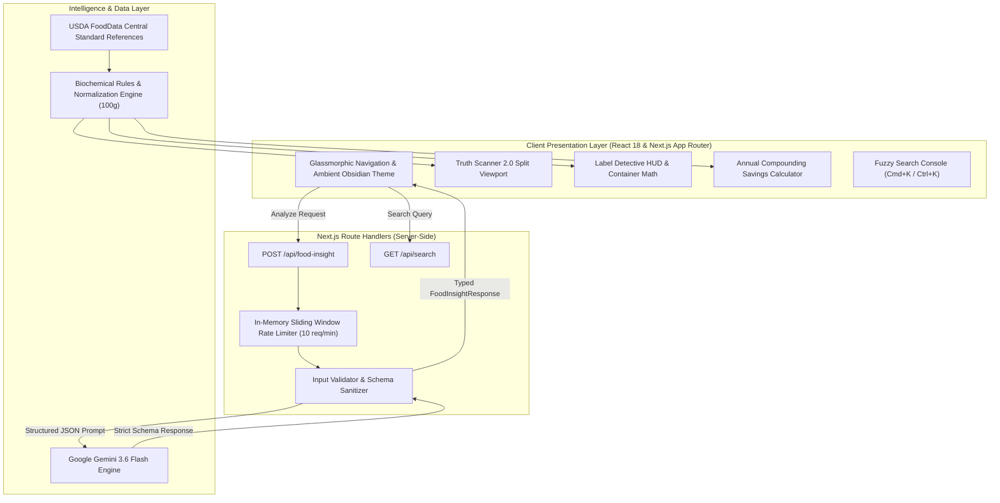

<div align="center">

# 🌿 NutriLens
### Next-Generation Nutrition Intelligence & Health Halo Decoder

[](https://nextjs.org/)
[](https://react.dev/)
[](https://www.typescriptlang.org/)
[](https://tailwindcss.com/)
[](https://ai.google.dev/)
[](https://fdc.nal.usda.gov/)
[](https://opensource.org/licenses/MIT)

<br />

[](https://vercel.com/new/clone?repository-url=https://github.com/aadityashekhar321/nutrilens)

<br />


<br />
<br />

**See past the health halo. Decode the biological reality behind deceptive food marketing with artificial intelligence.**

[Explore Web App](https://github.com/aadityashekhar321/nutrilens) • [Report Deceptive Food](https://github.com/aadityashekhar321/nutrilens/issues) • [Request Feature](https://github.com/aadityashekhar321/nutrilens/issues)

</div>

---

## ⚡ Overview & Mission

Food corporations spend upwards of **$14 Billion every year** employing sensory branding, greenwashed packaging, and regulatory loopholes to sell ultra-processed foods masquerading as nutritious wellness products.

**NutriLens** is an open-source, next-generation nutrition intelligence platform. It cross-examines front-of-box claims with **USDA FoodData Central** biochemical baselines and the **Google Gemini 3.6 Flash AI Engine** to provide consumers with objective, unfiltered transparency.

```text
Front-of-Box Claim:   "Organic Artisan Honey Oat Granola Bar"  🌿  (Health Halo)
Biochemical Reality:  28g Added Sugars = 7 Physical Sugar Cubes 🍬  (350 kcal / 75g package)
Metabolic Impact:     Equivalent to a slice of iced chocolate cake.
```

---

## 📸 Visual Product Showcase

<div align="center">


*NutriLens Truth Scanner 2.0 — Dual-split viewport contrasting marketing buzzwords against real biochemical impact.*

</div>

---

## 🌟 Core Diagnostic Tools

### 1. 🔍 Truth Scanner 2.0 (`/`)
- **Dual-Lens Viewport**: Drag or tap presets (`🏷️ Marketing Claim`, `⚖️ 50/50 Split`, `🔬 Lab Reality`) to expose front-of-pack claims against laboratory reality.
- **Physical Sugar Cube Stacks**: Translates abstract grams into tangible 4-gram sugar cubes (e.g., 24g sugar = 🟫🟫🟫🟫🟫🟫 6 cubes).
- **Interactive Telemetry Marquee**: Continuous ticker providing immediate metabolic facts and regulatory loophole statistics.

### 2. ⚖️ Food Face-Off Spectrometer (`/compare`)
- **Direct Head-to-Head Matchups**: Compare "perceived healthy" supermarket foods against genuinely superior alternatives across 8 categories (Dairy, Granola, Cereals, Beverages, Bread, Snacks, Protein, Energy).
- **100g Baseline Normalization Toggle**: Seamlessly switch between **"📦 As Stated on Box"** and **"⚖️ Standardized 100g Baseline"**. Exposes manufacturer tricks where serving sizes are shrunk to 25g to make sugar appear artificially low.
- **Dynamic Superiority Badges**: Computes percentage deltas in real-time (*"+150% Superior Fiber"*, *"72% Less Added Sugar"*).
- **Recharts Spectrometer**: Interactive grouped bar charts with custom delta tooltips, relative scales, and accessible color-coding.

### 3. 🤖 AI Food Scanner (`/food-insight`)
- **Neural Food Deconstruction**: Type any packaged food or beverage (*"Oatly Barista Oat Milk"*, *"Chobani French Vanilla Greek Yogurt"*, *"Kind Dark Chocolate Almond Bar"*).
- **Gemini 3.6 Flash Engine**: Evaluates ingredient formulations, glycemic spike risks, and additive nomenclature.
- **Portion Reality Multiplier**: Toggle between `1.0x Stated Serving`, `1.5x Typical Bowl`, `2.0x Double`, and `2.5x Entire Container` to recalculate nutrient grams and sugar cubes dynamically.
- **AHA Ceiling Alert**: Flags an immediate warning if your consumed portion surpasses the American Heart Association's recommended 25g daily added sugar maximum.
- **Radial Truth Score Gauge (0–100)**: Animated circular SVG dial color-coded by deception risk (Green = Clean, Amber = Moderate Discrepancy, Rose = High Deception).

### 4. 🕵️ Interactive Label Detective HUD (`/label-detective`)
- **Nutrition Facts X-Ray**: Interactive FDA-standard Nutrition Facts panel with clickable inspection targets.
- **Container Reality Math**: Click any line item to reveal the full-package impact (e.g., `140 kcal × 2.5 servings = 350 kcal` and `12g sugar × 2.5 = 30g total container sugar / 7.5 cubes`).
- **Interactive Detective Challenge**: Inspect case files (*"Artisan Wild Berry Fit-Crunch Bar"*), spot 3 hidden manufacturer loopholes, and test your label literacy.
- **5-Second Grocery Aisle Checklist**: Clickable rule mastery checklist with a live completion progress bar and certification unlock.

### 5. 🔄 Smart Swaps Studio (`/alternatives`)
- **1-to-1 Habit Swaps**: Practical food substitutions that preserve daily convenience while drastically reducing glycemic impact.
- **Compounding Annual Savings Calculator**:
  - Adjust weekly swap frequency from 1 to 14 times per week.
  - Computes **pounds of pure sugar eliminated annually** (e.g. `14.6 lbs/year`).
  - Converts savings into tangible analogies: **equivalent 12oz cans of soda purged** and **days of human resting metabolic energy spared**.
  - Highlights exact macro delta pills (`-18g Sugar`, `+6g Protein`, `+4g Fiber`) on every card.

### 6. 🥊 Athlete MythBusters (`/athletes`)
- **Sports Nutrition Evidence Base**: Debunks persistent fitness industry pseudo-science across Protein, Carbs, Hydration, Recovery, and Supplements.
- **Instant Search & Bulk Actions**: Filter myths in real-time by keyword (`protein`, `cramps`, `electrolytes`, `timing`) or toggle `Bust All` to review all truths simultaneously.
- **Clinical Training Protocols**: Actionable, peer-reviewed advice for endurance, hypertrophy, and recovery.

### 7. 🚨 Sneaky Culprit Radar (`/explore`)
- **60+ Hidden Sugar Aliases**: Search and filter through sneaky ingredient disguises (Maltodextrin, Dextrose, Evaporated Cane Juice, Agave Nectar, Barley Malt).
- **Intake Reality Gap Meter**: Visual meter contrasting safe clinical intake limits against the average consumer intake (e.g., 284% over safe limit for added sugar).

### 8. ⌨️ Global Command Search (`⌘K` / `Ctrl+K`)
- **Instant Fuzzy Search**: Accessible from anywhere in the application.
- **Full Keyboard Navigation**: Use `ArrowUp`, `ArrowDown`, and `Enter` with highlighted query matches and instant route transitions.

---

## 🏛️ System Architecture

NutriLens is built on the **Next.js 14 App Router** with full TypeScript validation, server-side Gemini AI orchestration, and client-side reactive visualizers.



---

## 🛠️ Technology Stack

| Technology | Version | Purpose |
| :--- | :--- | :--- |
| **Next.js** | `14.2.35` | App Router, Server Components, Route Handlers, Turbopack |
| **React** | `18.3` | Interactive client state, component hierarchy, hooks |
| **TypeScript** | `5.x` | Strict static typing, schema safety, zero `any` policy |
| **Tailwind CSS** | `v4.0` | Modern CSS variables, glassmorphism, hardware-accelerated shaders |
| **Google Gemini AI** | `3.6 Flash` | Fast structured nutritional inference and health halo risk assessment |
| **Recharts** | `3.10` | Responsive SVG grouped bar charts and custom delta spectrometer |
| **Lucide Icons** | Latest | Feather-light SVG iconography |
| **next-themes** | Latest | System-aware dark, light, and obsidian mode toggle |
| **USDA FoodData** | Official | USDA Agricultural Research Service nutritional profiles |

---

## 📂 Project Structure

```text
nutrilens/
├── public/
│   ├── images/
│   │   ├── banner.jpg                 # 4K showcase banner
│   │   └── truth_scanner.jpg          # Truth Scanner interface visual
│   ├── file.svg
│   ├── globe.svg
│   └── next.svg
├── src/
│   ├── app/
│   │   ├── alternatives/page.tsx      # Smart Swaps & Compounding Calculator
│   │   ├── athletes/page.tsx          # Athlete MythBusters & Live Search
│   │   ├── compare/page.tsx           # Food Face-Off & 100g Normalizer
│   │   ├── explore/page.tsx           # Sneaky Culprits & Alias Filter
│   │   ├── food-insight/page.tsx      # AI Food Scanner & Telemetry HUD
│   │   ├── label-detective/page.tsx   # Label Detective HUD & Checklist
│   │   ├── api/
│   │   │   ├── food-insight/route.ts  # Gemini AI rate-limited route handler
│   │   │   └── search/route.ts        # Instant fuzzy search endpoint
│   │   ├── globals.css                # Obsidian theme, scanlines, animations
│   │   ├── layout.tsx                 # Root layout with glassmorphic navbar
│   │   └── page.tsx                   # Truth Scanner 2.0 Hero & Bento Grid
│   ├── components/
│   │   ├── alternatives/              # AlternativeCard & macro upgrade badges
│   │   ├── comparison/                # NutritionChart, ComparisonCard, Toggles
│   │   ├── education/                 # CulpritCard, LabelTermCard, MythCard
│   │   ├── insight/                   # FoodInsightForm, InsightResult, Gauge
│   │   ├── label/                     # LabelSimulator, DeceptionChallenge, Checklist
│   │   ├── layout/                    # Full-width glass Navbar, Footer, ThemeToggle
│   │   ├── search/                    # SearchDialog (keyboard navigation)
│   │   └── ui/                        # Badge, PageHeader, Error/Loading states
│   ├── data/                          # 9 USDA-grounded nutritional datasets
│   ├── hooks/                         # use-comparison, use-food-insight, use-search
│   ├── lib/                           # ai-client, comparison-engine, rules
│   └── types/                         # TypeScript interfaces and response schemas
├── .env.example                       # Environment template for developers
├── package.json
├── tsconfig.json
└── README.md
```

---

## 🚀 Getting Started

### Prerequisites
- **Node.js**: `v18.17.0` or higher
- **Google Gemini API Key**: Free key from [Google AI Studio](https://aistudio.google.com/apikey)

### 1. Clone the Repository
```bash
git clone https://github.com/aadityashekhar321/nutrilens.git
cd nutrilens
```

### 2. Install Dependencies
```bash
npm install
```

### 3. Configure Environment
Create a `.env.local` file in your project root:
```bash
cp .env.example .env.local
```
Add your Gemini API key:
```env
GEMINI_API_KEY=your_gemini_api_key_here
```

### 4. Run Development Server
```bash
npm run dev
```
Visit [**http://localhost:3000**](http://localhost:3000) in your browser.

### 5. Production Build
```bash
npm run build
npm run start
```

---

## 🔬 Nutritional Methodology & Regulatory Science

NutriLens grounds every insight in peer-reviewed clinical guidelines and regulatory documentation:

1. **American Heart Association (AHA) Added Sugar Standards**:
   - **Men**: Maximum 36g / 9 teaspoons (9 sugar cubes) daily.
   - **Women**: Maximum 25g / 6 teaspoons (6 sugar cubes) daily.
   - **Children**: Maximum 24g / 6 teaspoons daily.
2. **FDA 21 CFR 101 Regulatory Loopholes Exposed**:
   - **The 0.5g Trans Fat Loophole**: Products containing under 0.5g of trans fat per serving are legally permitted to claim "0g Trans Fat". NutriLens flags hidden partially hydrogenated oils.
   - **Ingredient Splitting**: Brands divide sugars across 4+ synonyms (dextrose, cane syrup, maltodextrin) so that whole oats or fruit appear first on the ingredient list.
3. **World Health Organization (WHO) Sodium Limits**:
   - Recommended daily sodium intake ceiling is `< 2,000 mg/day` (5g salt).

---

## 🤝 Contributing

Contributions make the open-source community thrive. Any contributions you make are **greatly appreciated**!

1. Fork the Project
2. Create your Feature Branch (`git checkout -b feature/NewDiagnostic`)
3. Commit your Changes (`git commit -m 'Add NewDiagnostic capability'`)
4. Push to the Branch (`git push origin feature/NewDiagnostic`)
5. Open a Pull Request

---

## 📄 License & Disclaimer

Distributed under the **MIT License**. See `LICENSE` for details.

> [!NOTE]
> **Educational Disclaimer**: NutriLens is an educational and analytical research tool designed to foster public health literacy and critical thinking around food marketing claims. It does not constitute formal medical or dietary diagnosis. Always consult a certified healthcare professional or registered dietitian regarding specific clinical conditions.

---

<div align="center">

**NutriLens** • Built with ❤️ by [Aaditya Shekhar](https://github.com/aadityashekhar321)  
<sub>Empowering consumers with objective food intelligence. Powered by Google Gemini AI & USDA Open Data.</sub>

</div>
