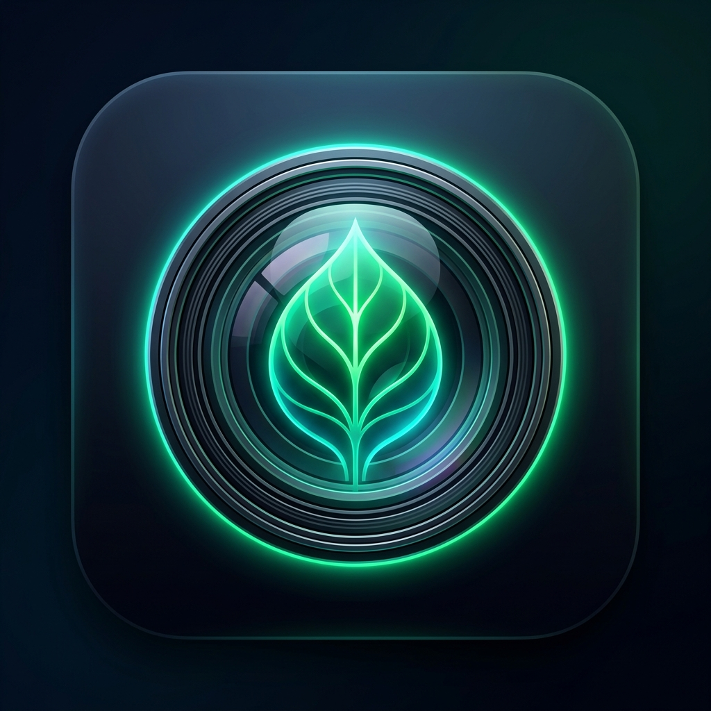
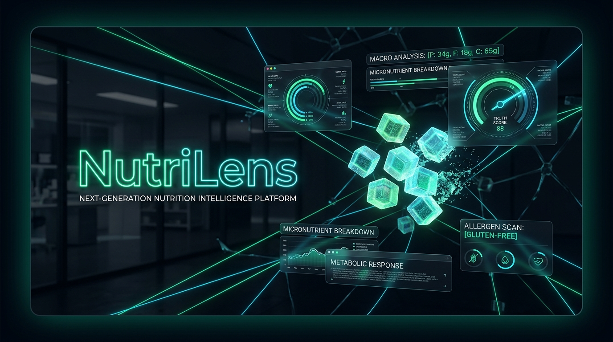
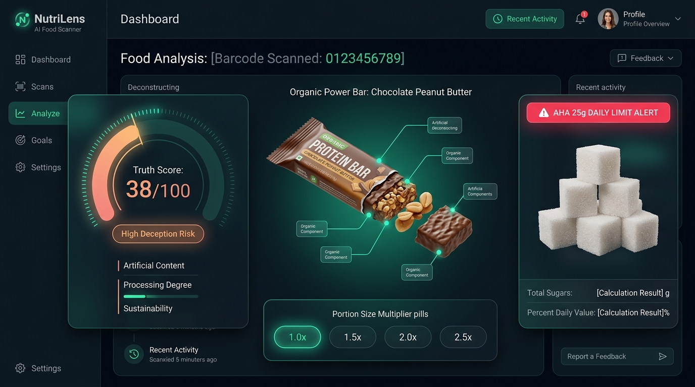
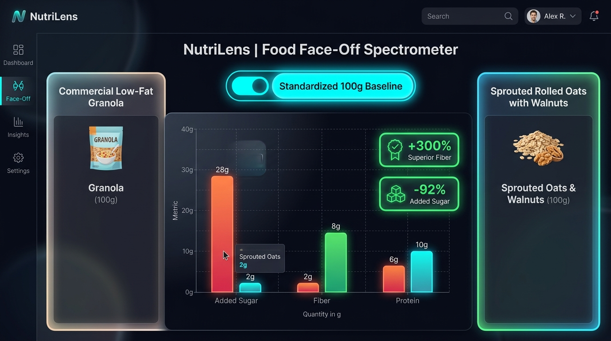
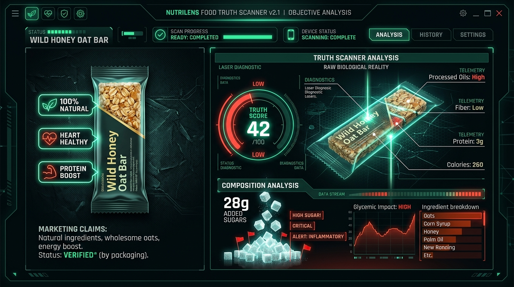

<div align="center">
  

  <br />
  
  # 🔍 NutriLens
  
  **AI-Powered Nutrition Intelligence & Deceptive Marketing Scanner**
  
  <br />

  [](https://nextjs.org/)
  [](https://reactjs.org/)
  [](https://tailwindcss.com/)
  [](https://ai.google.dev/)
  [](https://vitest.dev/)
  [](https://opensource.org/licenses/MIT)

  <br />
  
  [**Explore Demo**](#) · [**Report Bug**](#) · [**Request Feature**](#)
</div>

<br />

<div align="center">
  
</div>

<br />

## 🌟 What is NutriLens?

**NutriLens** is a next-generation analytical tool designed to shatter the "health halo" surrounding modern packaged foods. Powered by **Google Gemini AI** and grounded in **USDA nutritional data**, NutriLens exposes deceptive food marketing, calculates true metabolic impact, and empowers consumers with objective food intelligence.

Say goodbye to hidden sugars, arbitrary serving sizes, and false "artisan" claims. 

---

## 🚀 Showcase Features

### 🧠 Neural Food Scanner (Powered by Gemini)
Analyze any packaged food in seconds. Our AI breaks down complex ingredient lists, flags hidden "health halos", and recalculates true nutritional impact based on realistic portion multipliers.
<div align="center">
  
</div>

### ⚔️ Honest Food Face-Off
Compare foods head-to-head. Unlike marketing labels that manipulate serving sizes (e.g., 30g vs 55g), NutriLens normalizes everything to a **strict 100g baseline** for mathematically honest comparisons.
<div align="center">
  
</div>

### 🕵️ Label Detective HUD
Interactive breakdown of sneaky marketing claims. Learn the difference between "Made with Real Fruit", "Multigrain", and "Low-Fat", and see exactly how food engineers hide ultra-processed ingredients in plain sight.
<div align="center">
  
</div>

---

## 🛠️ Architecture & Tech Stack

NutriLens is built on a modern, high-performance web architecture:

| Domain | Technology | Description |
| :--- | :--- | :--- |
| **Framework** | **Next.js** `14.2` | App Router, Server Components, and Edge API Routes |
| **UI Library** | **React** `18.x` | Concurrent rendering and strict mode safe |
| **Styling** | **Tailwind CSS** `v4` | Modern tokens, CSS custom properties, glassmorphism |
| **Animations**| **Framer Motion** `13.x`| Spring physics, stagger variants, AnimatePresence |
| **AI Engine** | **Google Gemini** | Structured nutritional inference and health halo risk assessment |
| **Data Viz** | **Recharts** `3.10` | Responsive SVG grouped bar charts and custom delta spectrometer |
| **Rate Limit**| **Upstash Redis** | Distributed dual sliding-window rate limiting (`@upstash/ratelimit`) |
| **Testing** | **Vitest** `2.1.x` | Lightning-fast unit tests with TypeScript and ESM support |

---

## 💻 Getting Started & Local Setup

### Prerequisites
- **Node.js**: `v18.17.0` or higher
- **Google Gemini API Key**: Free key from [Google AI Studio](https://aistudio.google.com/apikey)
- *(Optional)* **Upstash Redis**: For production rate limiting

### 1. Clone & Install
```bash
git clone https://github.com/aadityashekhar321/nutrilens.git
cd nutrilens
npm install
```

### 2. Configure Environment
Copy the `.env.example` template:
```bash
cp .env.example .env.local
```
Open `.env.local` and add your keys:
```env
GEMINI_API_KEY=your_gemini_api_key_here
# Optional: UPSTASH_REDIS_REST_URL=...
# Optional: UPSTASH_REDIS_REST_TOKEN=...
```

### 3. Run Development Server
```bash
npm run dev
```
Navigate to [**http://localhost:3000**](http://localhost:3000) 🚀

---

## 📈 Roadmap & Milestones

- [x] **v1.0.0 — Foundation & Truth Scanner Release**
  - [x] Truth Scanner 2.0 with Dual-Viewport scrubbing.
  - [x] 100g Baseline Normalization for honest head-to-head comparisons.
  - [x] AI Food Scanner powered by Google Gemini.
  - [x] Distributed Rate Limiting & CI Pipeline automation.
- [ ] **v1.1.0 — Visual Barcode Ingestion**
  - [ ] WebRTC camera barcode scanning for instant UPC lookup against Open Food Facts.
- [ ] **v1.2.0 — Bioavailability & Micro-Nutrients**
  - [ ] Micronutrient bioavailability score (heme vs non-heme iron, calcium inhibitors).
  - [ ] Ultra-processed food classification via the clinical NOVA 4 framework.

---

## 🤝 Contributing

Contributions are what make the open-source community an incredible place to learn, inspire, and create. Any contributions you make are **greatly appreciated**!

1. Fork the Repository
2. Create your Feature Branch (`git checkout -b feature/AmazingDiagnostic`)
3. Commit your Changes (`git commit -m 'feat: Add AmazingDiagnostic tool'`)
4. Push to the Branch (`git push origin feature/AmazingDiagnostic`)
5. Open a Pull Request

---

## ⚖️ License & Clinical Disclaimer

Distributed under the **MIT License**. See `LICENSE` for more information.

> [!CAUTION]
> **Clinical & Educational Disclaimer**: NutriLens is an educational and analytical research tool designed to foster public health literacy and critical thinking around food marketing claims. It does not constitute formal medical or dietary diagnosis. Always consult a certified healthcare professional or registered dietitian regarding specific clinical conditions.

---

<div align="center">

**NutriLens** 🔍 Engineered with ❤️ by [Aaditya Shekhar](https://github.com/aadityashekhar321)  
<sub>Empowering consumers with objective food intelligence. Powered by Google Gemini AI & USDA Open Data.</sub>

<br />

<a href="#top"><b>Back to top ⬆️</b></a>

</div>
